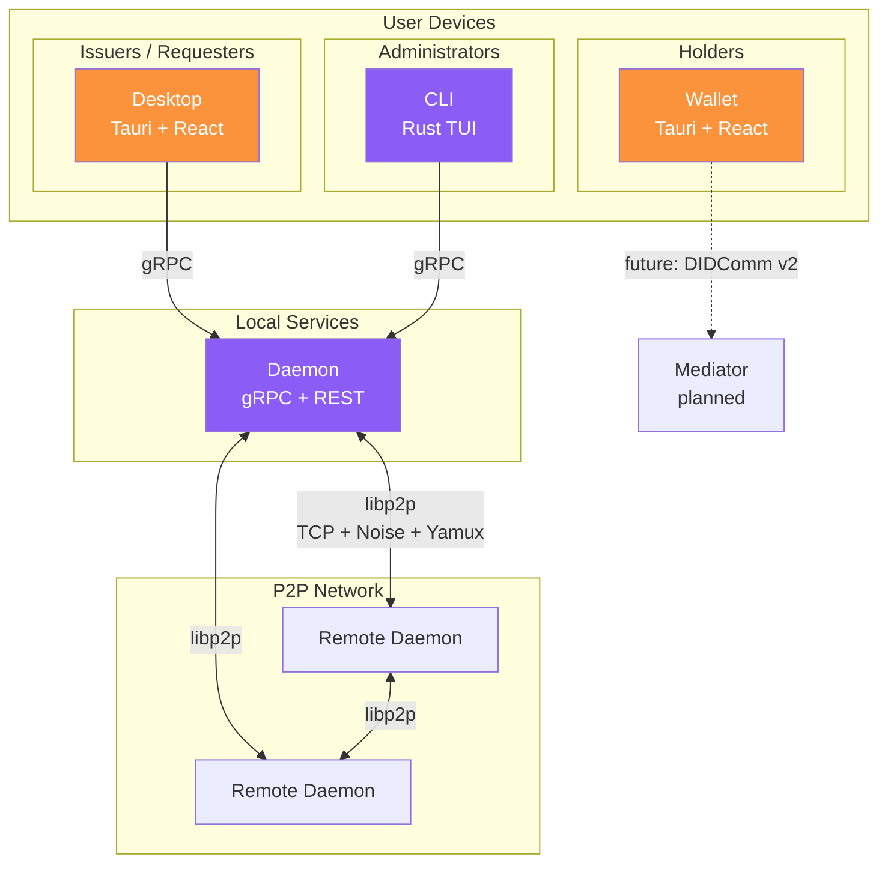
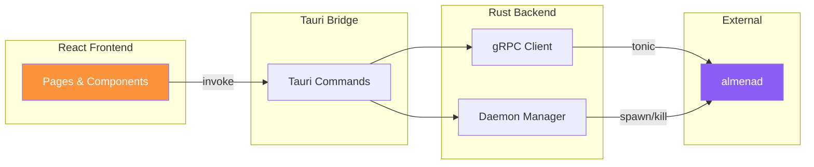
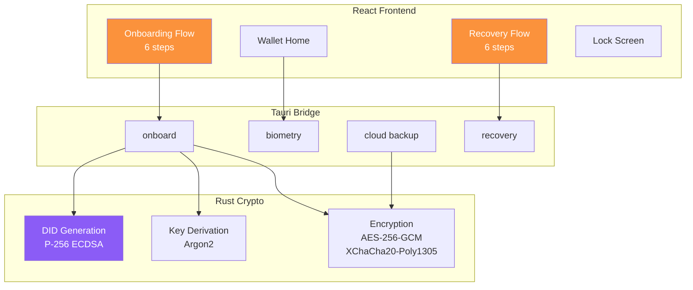
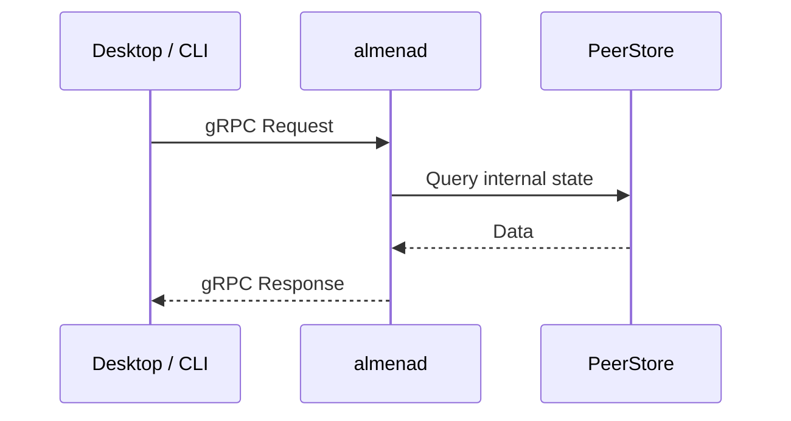
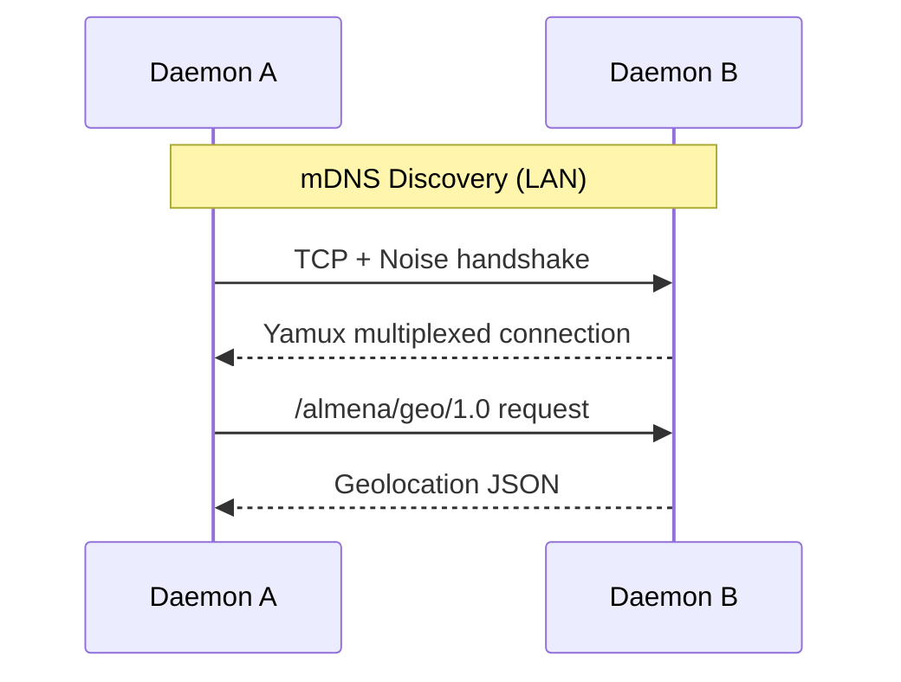
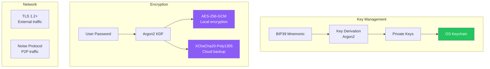

# Architecture

Almena Network follows a modular architecture where each component has a clear responsibility and communicates through well-defined interfaces.

## System Overview

## Components

### Daemon (`almenad`)

The daemon is the core background service that runs on every node. It is the **only component that participates in the P2P network**.

**Responsibilities:**
- Expose gRPC API for local clients (desktop, CLI)
- Expose REST API with Swagger UI for status checks
- Manage P2P connections via libp2p
- Discover peers on the local network (mDNS)
- Exchange geolocation data with peers via custom protocol (`/almena/geo/1.0`)
- Provide geolocation data for network visualization

**Technology:** Rust, tonic 0.12, libp2p 0.56, axum 0.8, tokio

**Source structure:**

| File | Purpose |
|------|---------|
| `main.rs` | gRPC server, service implementation |
| `p2p.rs` | libp2p swarm, peer discovery, geo exchange |
| `rest.rs` | Axum REST router, Swagger UI |
| `geolocation.rs` | Geo cache serialization |
| `path.rs` | Platform-specific data directories |

### Desktop

The desktop application is an admin console designed for **Issuers** (entities that issue credentials) and **Requesters** (entities that request credential presentations).

**Responsibilities:**
- Visualize the P2P network on an interactive world map
- Control the daemon lifecycle (start/stop)
- Display node dashboard with real-time status
- View and filter application logs
- Provide organization management interface

**Technology:** Tauri v2, React 19, TypeScript, tonic (Rust gRPC client)

**Architecture:**

### Wallet

The wallet is a mobile-first application for **Holders** — individuals who own and manage their digital identity (one of the platform's core capabilities).

**Responsibilities:**
- Create and manage decentralized identities (DIDs)
- Store private keys securely using AES-256-GCM with Argon2 key derivation
- Provide biometric authentication (fingerprint, Face ID)
- Manage encrypted cloud backups (Google Drive, iCloud)
- Support full identity recovery from cloud backups
- QR code scanning for credential exchange

**Technology:** Tauri v2, React 19, TypeScript

**Architecture:**

### CLI

The CLI provides a terminal interface for daemon management and monitoring.

**Responsibilities:**
- Start, stop, and ping the daemon
- Display daemon status in real time (2-second polling)
- Provide a text-based alternative to the desktop app

**Technology:** Rust, ratatui 0.29, crossterm 0.28, tonic (gRPC client)

## Communication Patterns

### Local Communication (gRPC)

Desktop and CLI communicate with the daemon via **gRPC** on the local machine:

The proto file at `daemon/proto/almena/daemon/v1/service.proto` is the **single source of truth**. Clients copy and generate code from this file.

### P2P Communication (libp2p)

Daemons discover and communicate with each other over the P2P network:

| Layer | Technology | Details |
|-------|-----------|---------|
| Transport | TCP | IPv4 + IPv6 |
| Encryption | Noise | All traffic encrypted |
| Multiplexing | Yamux | Multiple streams per connection |
| Discovery | mDNS | LAN peers, 5-second interval |
| Custom protocol | `/almena/geo/1.0` | Peer geolocation exchange |

Each daemon maintains a `PeerStore` — a thread-safe map of discovered peers with their connection status.

### Wallet Communication

The wallet currently operates independently without daemon gRPC. DID and credential operations happen locally in the Tauri Rust backend.

## Data Storage

### Platform Directories

Each module stores data in platform-specific locations:

| Module | macOS | Linux |
|--------|-------|-------|
| Daemon | `~/Library/Application Support/network.almena.daemon` | `~/.local/share/network.almena.daemon` |
| CLI | `~/Library/Application Support/network.almena.cli` | `~/.local/share/network.almena.cli` |
| Wallet | Tauri plugin-store (app data directory) | Tauri plugin-store |

In development mode, all modules use a local `./workspace/` directory.

### Security Model

| Purpose | Technology |
|---------|-----------|
| **Signing** | P-256 ECDSA (wallet), Ed25519 (daemon) |
| **Key agreement** | X25519 (ECDH) |
| **Symmetric encryption** | AES-256-GCM (local), XChaCha20-Poly1305 (backup) |
| **Key derivation** | Argon2 (password), BIP39 + BIP32 (mnemonic) |
| **Hashing** | SHA-256 |
| **Network** | TLS 1.2+ (external), Noise protocol (P2P) |

## Design System

All frontend applications (desktop and wallet) share a **glassmorphism** design system:

| Token | Value |
|-------|-------|
| Primary color | `#FB923C` (orange) |
| Secondary color | `#8B5CF6` (violet) |
| Background | `#0c0a09` (deep dark) |
| Glass effect | `rgba(255,255,255,0.05)` + `backdrop-filter: blur(12px)` |
| Border radius | 8-12px |
| Base spacing | 8px unit |
| Transitions | 200-250ms ease-out |
| Typography | Inter, Outfit, or similar geometric sans-serif |
| Navigation | Floating dock (macOS-style, centered bottom) |
