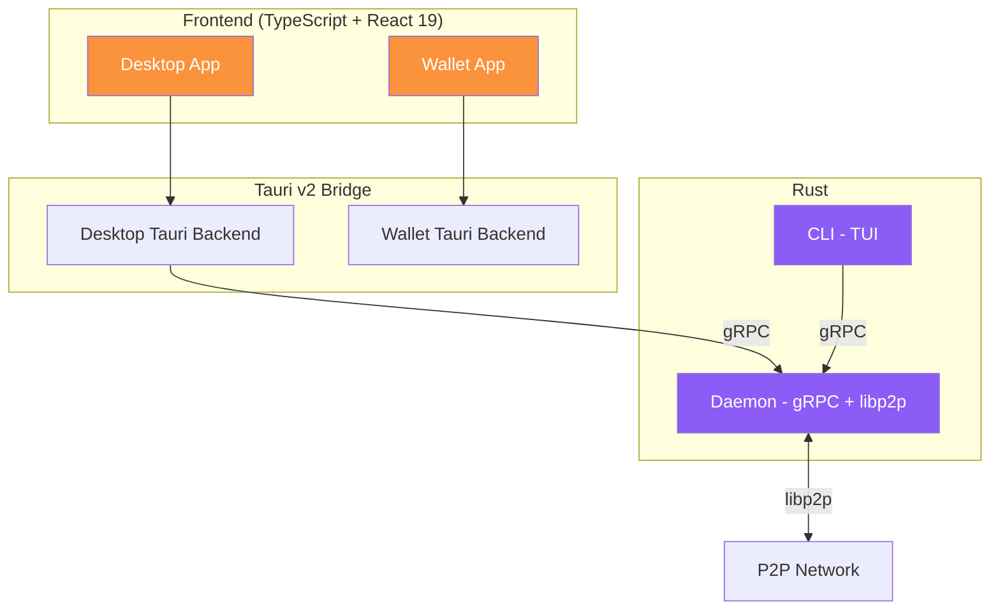

# Almena Network for Developers

Documentation for team members developing the Almena Network platform modules.

## Platform Overview

Almena Network is a decentralized identity platform built on W3C standards (DIDs, Verifiable Credentials). The project is organized as a **monorepo with git submodules**, where each module is an independent repository tracking the `develop` branch.

## Modules

| Module | Technology | Description | Status |
|--------|-----------|-------------|--------|
| [**Daemon**](./modules/daemon) | Rust, tonic, libp2p | gRPC server and P2P networking | 5 RPCs, mDNS discovery, REST API |
| [**Desktop**](./modules/desktop) | Tauri v2, React 19, TypeScript | Admin console for Issuers/Requesters | Dashboard, Network map, Logs |
| [**Wallet**](./modules/wallet) | Tauri v2, React 19, TypeScript | Mobile-first identity wallet for Holders | 6-step onboarding, recovery, biometrics, cloud backup |
| [**CLI**](./modules/cli) | Rust, ratatui, crossterm | Terminal interface to daemon | TUI with daemon management |
| **Docs** | Docusaurus 3 | Documentation site (this site) | EN + ES |

## Quick Links

- [**Getting Started**](./getting-started) — Set up your development environment.
- [**Architecture**](./architecture) — System architecture and design decisions.
- [**Module Guides**](./modules/daemon) — Deep dive into each module's implementation.

## Tech Stack

| Layer | Technology |
|-------|-----------|
| Frontend | React 19, TypeScript 5.8, Vite 7 |
| Desktop framework | Tauri v2 |
| Backend | Rust 2021 edition |
| gRPC | tonic 0.12, prost 0.13 |
| P2P | libp2p 0.56 |
| CLI TUI | ratatui 0.29, crossterm 0.28 |
| Package managers | pnpm (Node), cargo (Rust) |
| Task runner | [Taskfile](https://taskfile.dev/) |
| Documentation | Docusaurus 3 |

## Version Scheme

All modules follow date-based versioning: `YYYY.MM.DD[-variant]`

Examples: `2026.3.5-alpha`, `2026.1.1-develop`
