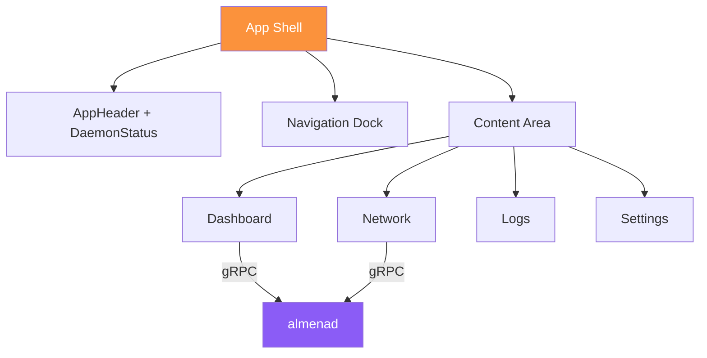

# Module: Desktop

The desktop application is the admin console for organizations acting as **Issuers** (credential issuers) and **Requesters** (credential verifiers).

## Overview

| Property | Value |
|----------|-------|
| App identifier | `network.almena.desktop.dev` |
| Framework | Tauri v2 + React 19 |
| Version | `2026.3.5-alpha` |
| Window size | 1440×900 (min 1024×768) |
| Repository | `almena-network/desktop` |

## Source Structure

```
desktop/
├── src/                          # React frontend
│   ├── main.tsx                  # Entry point
│   ├── App.tsx                   # Navigation and routing
│   ├── App.css                   # Design tokens (glassmorphism)
│   ├── components/
│   │   ├── AppHeader.tsx         # Top bar with daemon status
│   │   ├── DaemonStatusButton.tsx # Start/stop daemon control
│   │   ├── Dock.tsx              # Bottom navigation with SVG icons
│   │   └── Footer.tsx            # Version and GitHub link
│   ├── pages/
│   │   ├── Dashboard.tsx         # Node overview + world map
│   │   ├── Network.tsx           # Peer list with status
│   │   ├── Logs.tsx              # Application log viewer
│   │   └── Settings.tsx          # Placeholder
│   └── i18n/                     # English and Spanish translations
│
├── src-tauri/                    # Rust backend
│   ├── src/
│   │   ├── main.rs               # Tauri entry point
│   │   ├── lib.rs                # Tauri commands
│   │   ├── grpc.rs               # gRPC client to daemon
│   │   └── daemon.rs             # Daemon process management
│   ├── proto/                    # Proto files (copied from daemon)
│   ├── tauri.conf.json           # App configuration
│   └── Cargo.toml                # Rust dependencies
│
├── package.json                  # Node dependencies
├── vite.config.ts                # Vite configuration
└── Taskfile.yml                  # Task orchestration
```

## Application Flow



## Implemented Features

### Dashboard

- Daemon status, version, and node ID display
- Public IP and geolocation information
- Interactive **world map** (react-simple-maps) centered on the local node
- Peer markers: orange (local node, 6px), violet (peers, 4px)
- Real-time polling every 5 seconds

### Network Explorer

- Peer list showing: truncated Peer ID, connection status, LAN/Internet type, geolocation, address count
- Local node marked with "This node" badge
- Auto-refreshes every 5 seconds

### Application Logs

- Rotating log file viewer (`almena-desktop.log` and date-stamped files)
- Manual refresh button
- Auto-scroll to latest entries

### Daemon Control

- Status button in header: red (stopped), green (running), yellow (checking)
- Click to start/stop the daemon process
- Retry logic: 5 attempts with 500ms delays on startup

### Internationalization

- Supported languages: English (en), Spanish (es)
- Auto-detects OS language preference
- Resource keys organized by domain: `app.*`, `nav.*`, `daemon.*`, `network.*`

## Tauri Commands

Commands exposed to the React frontend via `invoke()`:

| Command | Returns | Description |
|---------|---------|-------------|
| `start_daemon()` | `Result<String>` | Start the daemon process |
| `stop_daemon()` | `Result<String>` | Stop the daemon process |
| `list_peers()` | `Result<Vec<PeerInfoJson>>` | Fetch peers from daemon |
| `get_geolocation()` | `Result<GeolocationJson>` | Fetch node geolocation |

## gRPC Integration

The Rust backend (`src-tauri/src/grpc.rs`) acts as a bridge between the React frontend and the daemon:

1. React calls `invoke("list_peers")` via Tauri IPC
2. Rust handler connects to daemon at `DAEMON_GRPC_URL` (default: `http://[::1]:50051`)
3. gRPC response is converted to JSON-serializable structs
4. JSON response is returned to React

## Daemon Process Management

The desktop app manages the daemon lifecycle differently in dev vs production:

| Mode | Start | Stop |
|------|-------|------|
| **Development** | Spawns binary from `ALMENAD_DIR` | Kills process by PID |
| **macOS** | `launchctl load ...plist` | `launchctl unload ...plist` |
| **Linux** | `systemctl --user start almenad` | `systemctl --user stop almenad` |
| **Windows** | `sc start AlmenaD` | `sc stop AlmenaD` |

## Development

```bash
# Install dependencies
task install

# Run in dev mode (starts Vite + Tauri)
task dev

# Type-check
task check

# Build for production
task build

# Preview built frontend
task preview
```

### Environment Variables

| Variable | Default | Description |
|----------|---------|-------------|
| `DAEMON_GRPC_URL` | `http://[::1]:50051` | Daemon gRPC endpoint |
| `ALMENAD_DIR` | `../../daemon/target/debug` | Path to daemon binary (dev mode) |

### Proto Workflow

After the daemon proto changes:

```bash
task proto:copy     # Copy proto from daemon
task proto:client   # Rebuild gRPC client
```

## Pending Implementation

- **Settings** — Placeholder page
- **Credential issuance** workflows
- **Presentation request** handling
- **Organization management** UI
