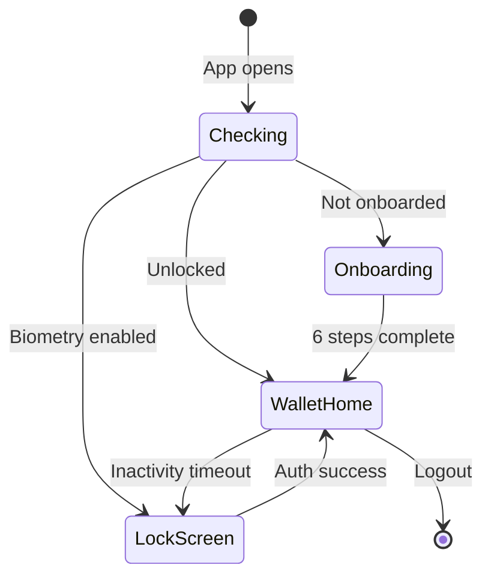
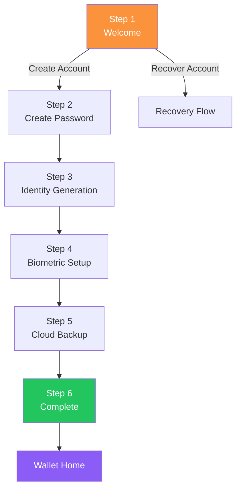
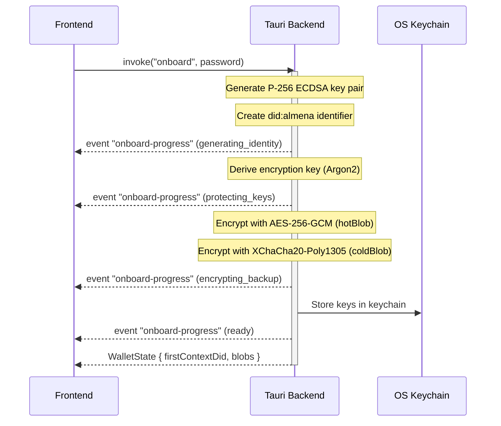
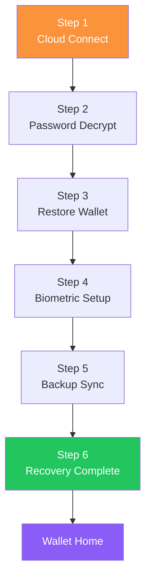

# Module: Wallet

The wallet is a mobile-first application for **Holders** — individuals who create and manage their decentralized identity.

## Overview

| Property | Value |
|----------|-------|
| App identifier | `network.almena.wallet` |
| Framework | Tauri v2 + React 19 |
| Version | `2026.2.26` |
| Window size | 390x844 (min 360x640, max 768x1024) |
| Repository | `almena-network/wallet` |
| Platforms | Desktop, Android, iOS |

## Source Structure

```
wallet/
├── src/                              # React frontend
│   ├── main.tsx                      # Entry point
│   ├── App.tsx                       # Router + AppGate (state machine)
│   ├── i18n.ts                       # i18next setup (en, es)
│   ├── types/wallet.ts               # TypeScript interfaces
│   ├── lib/logger.ts                 # Debug logging
│   ├── locales/
│   │   ├── en.json                   # English translations
│   │   └── es.json                   # Spanish translations
│   ├── layouts/
│   │   └── WalletLayout.tsx          # Main layout with nav dock
│   ├── onboarding/
│   │   ├── OnboardingFlow.tsx        # 6-step onboarding orchestrator
│   │   └── onboardingReducer.ts      # Onboarding state machine
│   ├── recovery/
│   │   ├── RecoveryFlow.tsx          # 6-step recovery orchestrator
│   │   └── recoveryReducer.ts        # Recovery state machine
│   ├── pages/
│   │   ├── Onboarding.tsx            # Step 1: Welcome
│   │   ├── CreatePassword.tsx        # Step 2: Password
│   │   ├── IdentityGenerationScreen.tsx  # Step 3: DID generation
│   │   ├── BiometrySetupScreen.tsx   # Step 4: Biometrics
│   │   ├── CloudBackupScreen.tsx     # Step 5: Cloud backup
│   │   ├── OnboardingCompleteScreen.tsx  # Step 6: Summary
│   │   ├── LockScreen.tsx            # Biometric/password unlock
│   │   ├── wallet/
│   │   │   ├── WalletHome.tsx        # Main wallet view
│   │   │   ├── WalletScan.tsx        # QR scanner
│   │   │   ├── WalletMessages.tsx    # Messages/credentials
│   │   │   ├── WalletSettings.tsx    # Settings
│   │   │   └── WalletLogout.tsx      # Logout/reset
│   │   └── recovery/
│   │       ├── CloudConnectScreen.tsx     # Recovery step 1
│   │       ├── PasswordDecryptScreen.tsx  # Recovery step 2
│   │       ├── RestoreWalletScreen.tsx    # Recovery step 3
│   │       ├── BiometrySetupScreen.tsx    # Recovery step 4
│   │       ├── BackupSyncScreen.tsx       # Recovery step 5
│   │       └── RecoveryCompleteScreen.tsx # Recovery step 6
│
├── src-tauri/                        # Rust backend
│   ├── src/
│   │   ├── main.rs                   # Binary entry point
│   │   ├── lib.rs                    # Tauri command handlers
│   │   ├── onboarding.rs            # DID generation, key derivation, encryption
│   │   ├── recovery.rs              # Backup decryption, wallet restoration
│   │   ├── biometry.rs              # Biometric device integration
│   │   ├── cloud_backup.rs          # Cloud provider integration
│   │   ├── keystore.rs              # Secure key storage
│   │   └── wallet_state.rs          # Persistent wallet state
│   ├── tauri.conf.json
│   └── Cargo.toml
│
├── package.json
├── vite.config.ts
└── Taskfile.yml
```

## Application State Machine



The `AppGate` component in `App.tsx` calls `get_lock_screen_info` on mount to determine the initial route.

## Routing

| Path | Component | Description |
|------|-----------|-------------|
| `/` | `AppGate` | State machine entry — routes to onboarding, lock, or wallet |
| `/recover` | `RecoveryFlow` | 6-step recovery flow |
| `/wallet/home` | `WalletHome` | Main wallet view with DID display |
| `/wallet/scan` | `WalletScan` | QR code scanner |
| `/wallet/messages` | `WalletMessages` | Credential messages |
| `/wallet/settings` | `WalletSettings` | User settings |
| `/wallet/logout` | `WalletLogout` | Logout and reset |

## Onboarding Flow (6 Steps)



| Step | Component | Tauri Command | Description |
|------|-----------|---------------|-------------|
| 1 | `Onboarding` | — | Welcome screen with create/recover options |
| 2 | `CreatePassword` | — | Password with validation (8+ chars, upper, lower, digit) |
| 3 | `IdentityGenerationScreen` | `onboard(password)` | DID creation, key derivation, backup encryption |
| 4 | `BiometrySetupScreen` | `check_biometry_available`, `enable_biometry` | Optional fingerprint/Face ID |
| 5 | `CloudBackupScreen` | `get_available_cloud_providers`, `start_cloud_auth`, `upload_backup` | Encrypted cloud backup |
| 6 | `OnboardingCompleteScreen` | `complete_onboarding(summary)` | DID summary, checklist, enter wallet |

### Identity Generation Detail



### State Management

The onboarding flow uses a **reducer pattern** (`onboardingReducer.ts`) with 6 steps. The `OnboardingFlow` component orchestrates step transitions and provides:

- **Exit protection** — Confirms before leaving during critical steps
- **Progress indicator** — Visual progress bar across all steps

## Recovery Flow (6 Steps)



| Step | Component | Tauri Command | Description |
|------|-----------|---------------|-------------|
| 1 | `CloudConnectScreen` | `start_cloud_auth`, `search_backup`, `download_backup` | Find and download encrypted backup |
| 2 | `PasswordDecryptScreen` | `decrypt_backup(blob, password)` | Decrypt backup with original password |
| 3 | `RestoreWalletScreen` | `restore_wallet(payload)` | Restore DID, keys, contexts |
| 4 | `BiometrySetupScreen` | `check_biometry_available`, `enable_biometry` | Re-enroll biometrics |
| 5 | `BackupSyncScreen` | `sync_updated_backup` | Sync updated state to cloud |
| 6 | `RecoveryCompleteScreen` | `complete_recovery` | Summary and enter wallet |

Recovery sessions have a **10-minute inactivity timeout** that clears the session and returns to the welcome screen.

## Tauri Commands

### Onboarding

| Command | Parameters | Returns | Description |
|---------|-----------|---------|-------------|
| `onboard` | `password: string` | `WalletState` | Generate DID, derive keys, encrypt backups |
| `complete_onboarding` | `WalletSummary` | `void` | Finalize onboarding |
| `is_onboarding_complete` | — | `bool` | Check onboarding status |

### Biometry

| Command | Parameters | Returns | Description |
|---------|-----------|---------|-------------|
| `check_biometry_available` | — | `BiometryInfo` | Check device support |
| `enable_biometry` | — | `bool` | Enroll biometric auth |

### Cloud Backup

| Command | Parameters | Returns | Description |
|---------|-----------|---------|-------------|
| `get_available_cloud_providers` | — | `CloudProvider[]` | List providers |
| `start_cloud_auth` | `provider: string` | `bool` | Authenticate with provider |
| `upload_backup` | `cold_blob: string` | `UploadResult` | Upload encrypted backup |
| `search_backup` | `provider: string` | `BackupSearchResult` | Find existing backup |
| `download_backup` | `fileId, provider` | `bytes` | Download backup blob |
| `sync_updated_backup` | `...` | `SyncResult` | Sync after restoration |

### Recovery

| Command | Parameters | Returns | Description |
|---------|-----------|---------|-------------|
| `decrypt_backup` | `blob, password` | `RecoveryPayload` | Decrypt backup |
| `restore_wallet` | `RecoveryPayload` | `RestorationResult` | Restore identity |
| `clear_recovery_session` | — | `void` | Clean up session |
| `complete_recovery` | `...` | `void` | Finalize recovery |

### Wallet State

| Command | Parameters | Returns | Description |
|---------|-----------|---------|-------------|
| `get_wallet_summary` | — | `WalletSummary` | Current wallet info |
| `get_lock_screen_info` | — | `LockScreenInfo` | Lock state, biometry status |
| `logout` | — | `void` | Reset wallet |

## Cryptography

| Purpose | Algorithm | Standard |
|---------|-----------|----------|
| DID key pair | P-256 ECDSA | FIPS 186-5 |
| Password KDF | Argon2 | RFC 9106 |
| Local encryption | AES-256-GCM | NIST SP 800-38D |
| Backup encryption | XChaCha20-Poly1305 | IETF |
| Mnemonic | BIP39 | BIP-39 |

Two encrypted blobs are generated during onboarding:
- **hotBlob** — Optimized for local device use (AES-256-GCM)
- **coldBlob** — Full backup for cloud storage (XChaCha20-Poly1305)

## Lock Screen

- **Biometry enabled**: Auto-prompts fingerprint/Face ID on app launch
- **Inactivity timeout**: 5 minutes of no interaction
- **Background timeout**: 30 seconds in background
- **Fallback**: Password authentication always available

## Design System

Mobile-specific glassmorphism adjustments:

| Token | Value |
|-------|-------|
| Glass background | `rgba(255,255,255,0.04)` |
| Glass border | `rgba(255,255,255,0.06)` |
| Backdrop blur | 16px |
| Touch targets | 44x44 px minimum |
| Viewport | 390x844 (mobile-first) |

## Development

```bash
# Install dependencies
task install

# Desktop dev mode
task dev

# Android dev
task dev:android

# iOS dev
task dev:ios

# Type-check
task check

# Build production
task build

# Regenerate icons
task icon

# One-time platform init
task init:android
task init:ios
```

## Pending Implementation

- **gRPC client** integration with daemon
- **Credential management** (receive, store, present)
- **DIDComm messaging**
- **Verifiable Presentations**
