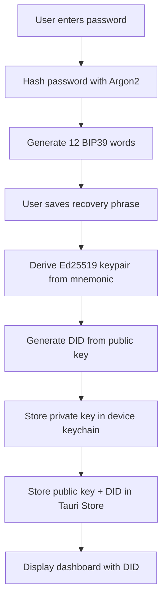
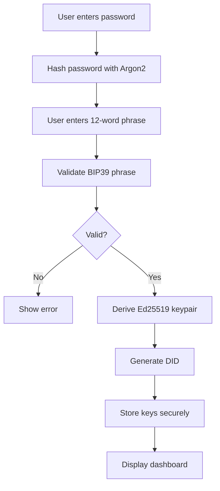

# Wallet Architecture

Understand how the Almena ID Wallet is built and how it secures user identities.

## Overview

The Almena ID Wallet is a cross-platform native application built with:
- **Tauri 2.0**: Cross-platform framework (Rust backend + web frontend)
- **Svelte 5 + SvelteKit**: Modern reactive UI framework
- **Rust**: Backend for cryptography and system integration

## Platform Support

The same codebase runs natively on:
- **Desktop**: Windows, macOS, Linux
- **Mobile**: Android, iOS

No code changes needed between platforms - Tauri handles platform differences.

## Security Architecture

### Cryptographic Standards

**Key Generation**:
- **BIP39**: 12-word mnemonic generation and validation
- **Ed25519**: Elliptic curve cryptography for keypairs
- **Deterministic**: Same mnemonic always produces same keys

**Password Security**:
- **Argon2**: Industry-standard password hashing
- **No plaintext**: Passwords never stored in plaintext
- **Device-specific**: Each device can have different password

### Secure Storage

**Private Key Storage** (Platform-Specific):
- **macOS/iOS**: Keychain Services
- **Windows**: Windows Credential Manager  
- **Linux**: Secret Service (GNOME Keyring, KWallet)
- **Android**: Android Keystore

**Public Data Storage**:
- **Tauri Plugin Store**: Secure JSON storage for:
  - DID (Decentralized Identifier)
  - Public key
  - Password hash
  - User preferences

**Why This Approach?**:
- Private keys never exposed to JavaScript layer
- OS-level encryption and access control
- Biometric authentication integration
- Cross-process security boundaries

### Identity Generation Flow

### Identity Recovery Flow

## Session Management

### Auto-Lock Feature

**Purpose**: Protect identity when device is unattended

**Implementation**:
- Monitors user activity events (mouse, keyboard, touch)
- Tracks last activity timestamp
- Checks every 10 seconds for inactivity
- Locks after 5 minutes without activity

**Locked State**:
- User redirected to unlock screen
- Must re-authenticate with password or biometric
- Session state preserved
- No data loss

### Biometric Authentication

**Supported Platforms**:
- ✅ macOS: Touch ID via LocalAuthentication framework
- 🔄 iOS: Touch ID / Face ID (coming soon)
- 🔄 Android: Biometric API (coming soon)
- 🔄 Windows: Windows Hello (coming soon)
- ❌ Linux: Not available

**Implementation**:
- OS-level biometric API integration
- Biometric data never exposed to app
- App only receives success/failure result
- Password remains available as fallback

## Data Flow

### What Stays Local

Everything identity-related is local-only:
- ✅ Private keys
- ✅ Recovery phrases (never stored after setup)
- ✅ Passwords
- ✅ DID generation
- ✅ Key derivation

### What's Never Transmitted

The wallet never sends over network:
- ❌ Private keys
- ❌ Recovery phrases
- ❌ Passwords
- ❌ Mnemonic words
- ❌ Biometric data
- ❌ Any sensitive cryptographic material

### What Can Be Shared

Safe to transmit:
- ✅ DID (public identifier)
- ✅ Public keys
- ✅ Verifiable credentials (when implemented)
- ✅ Signed messages

## Technology Stack

### Frontend
- **Svelte 5**: Reactive UI with runes ($state, $derived)
- **SvelteKit**: Routing and SSR support
- **TypeScript**: Type-safe development
- **Vite**: Fast build tool

### Backend (Rust)
- **Tauri 2.0**: Cross-platform app framework
- **bip39**: BIP39 mnemonic generation
- **ed25519-dalek**: Ed25519 cryptography
- **keyring**: Cross-platform keychain access
- **argon2**: Password hashing
- **tauri-plugin-store**: Secure data storage

### Build & Distribution
- **Single codebase** for all platforms
- **Native compilation** per platform
- **Small bundle size**: ~5-15 MB per platform
- **No runtime dependencies**: Fully self-contained

## Integration Points

### For Application Integrators

While the wallet is a standalone app, you can integrate with it through:

1. **Deep Links** (coming soon):
   - Trigger wallet actions from your app
   - Request signatures
   - Credential presentations

2. **DID Resolution**:
   - User shares their DID
   - Verify credentials using public key
   - Cryptographic verification

3. **API Integration** (coming soon):
   - Backend API for identity verification
   - Credential issuance
   - Signature verification

## Security Considerations for Integrators

### What You Can Trust

✅ **DIDs are globally unique**: No collisions
✅ **Public keys are authentic**: Derived deterministically
✅ **Signatures are valid**: If verified correctly
✅ **Cross-platform consistency**: Same DID everywhere

### What You Should Verify

⚠️ **Always verify signatures** before trusting data
⚠️ **Check DID format** matches expected pattern
⚠️ **Validate credentials** with proper cryptography
⚠️ **Don't trust client-side** identity claims without verification

## Performance Characteristics

### Startup Time
- Cold start: ~1-2 seconds
- Warm start: ~500ms

### Identity Operations
- Create identity: ~1-2 seconds (key generation)
- Recover identity: ~1-2 seconds (key derivation)
- Unlock: ~100-500ms (password verification)
- Biometric unlock: ~1 second (OS-dependent)

### Storage Requirements
- App size: 5-15 MB (platform-dependent)
- Identity data: Less than 1 MB per identity
- Cache: 1-5 MB

## Limitations

### Current Limitations

- Single identity per device (multi-identity coming soon)
- No credential issuance yet (coming soon)
- No signature operations exposed yet (coming soon)
- No deep link support yet (coming soon)

### Platform Limitations

- Linux: No native biometric support
- Android/iOS: Biometric implementation pending
- Windows: Windows Hello implementation pending

## Related Documentation

- [Creating Your Identity →](../user-guide/wallet/creating-identity.md)
- [Security Features →](../user-guide/security/auto-lock.md)
- [Supported Platforms →](../user-guide/supported-platforms.md)
- [API Reference →](../api-reference/endpoints/health.md)
