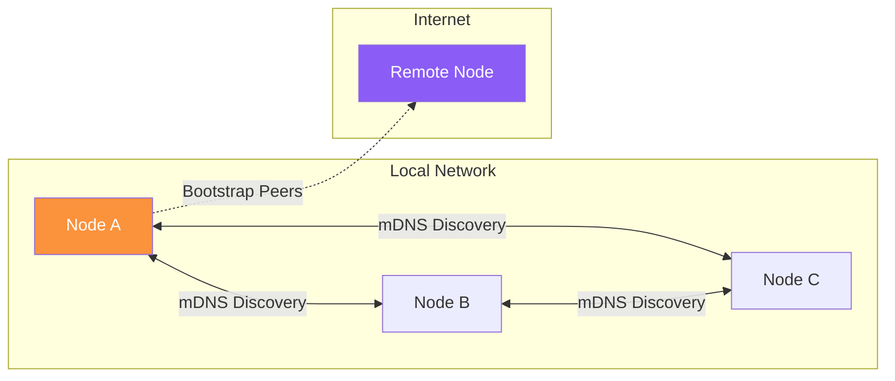

# Daemon Setup

The Almena daemon (`almenad`) is the background service that powers the P2P network and exposes the gRPC API. This guide covers how to install and run it.

## Prerequisites

- **Rust** toolchain (2021 edition, install via [rustup](https://rustup.rs/))
- **Protocol Buffers** compiler (`protoc`)
  - macOS: `brew install protobuf`
  - Linux: `apt install protobuf-compiler`
  - Windows: `choco install protoc`
- **Task** runner ([taskfile.dev](https://taskfile.dev/))

## Installation from Source

```bash
git clone git@github.com:almena-network/daemon.git
cd daemon
task install
task build
```

The release binary is located at `target/release/almenad`.

## Running the Daemon

### Development Mode

```bash
task dev
```

This starts the daemon with:
- Debug logging enabled
- Data stored in `./workspace/` directory
- Hot reload via `cargo watch`
- gRPC server on `[::1]:50051` (IPv6 localhost)

### Production Mode

```bash
./almenad
```

Or with custom settings:

```bash
./almenad --grpc-addr "[::1]:50051"
```

#### CLI Options

| Flag | Default | Description |
|------|---------|-------------|
| `--grpc-addr` | `[::1]:50051` | gRPC listen address |
| `--dev` | `false` | Enable debug logging and use dev workspace |
| `--version` | — | Print version and exit |

### Environment Variables

| Variable | Description |
|----------|-------------|
| `RUST_LOG` | Log level override (`trace`, `debug`, `info`, `warn`, `error`) |
| `GRPC_ADDR` | Alternative to `--grpc-addr` flag |
| `ALMENAD_DATA_DIR` | Custom data directory (dev mode only) |

## Data Directories

The daemon stores its data in platform-specific locations:

| Platform | Path |
|----------|------|
| macOS | `~/Library/Application Support/network.almena.daemon` |
| Linux | `~/.local/share/network.almena.daemon` |
| Windows | `%APPDATA%\network.almena.daemon` |

In development mode (`--dev`), all data is stored in the local `./workspace/` directory.

## Platform Installers

Pre-built installers are available for each platform:

| Platform | Format | Build Command |
|----------|--------|---------------|
| macOS | `.pkg` (signed and notarized) | `task package:darwin` |
| Linux | `.deb` | `task package:linux` |
| Windows | `.msi` | `task package:windows` |

The macOS installer registers the daemon as a **LaunchAgent** (starts automatically on login). On Linux, a **systemd** user service is created. On Windows, it runs as a **Windows Service**.

## Verifying the Installation

Once the daemon is running, verify connectivity with any gRPC client:

```bash
# Using grpcurl
grpcurl -plaintext '[::1]:50051' almena.daemon.v1.DaemonService/Ping
```

Expected response:

```json
{
  "message": "pong"
}
```

The daemon also supports **gRPC Server Reflection**, so tools like Postman and grpcurl can discover all available methods automatically.

## REST API

The daemon also exposes a REST API for quick status checks:

```bash
# Default REST endpoint
curl http://127.0.0.1:8080/status

# Swagger UI
open http://127.0.0.1:8080/swagger-ui/
```

The REST address is configurable via `--rest-addr`.

## P2P Networking

The daemon automatically discovers other Almena nodes on your local network using **mDNS** (multicast DNS). Discovered peers appear in the `ListPeers` response.



| Layer | Technology | Details |
|-------|-----------|---------|
| **Transport** | TCP | IPv4 + IPv6 support |
| **Encryption** | Noise protocol | All P2P traffic encrypted |
| **Multiplexing** | Yamux | Multiple streams per connection |
| **Discovery** | mDNS | LAN peers (5-second query interval) |
| **Custom protocol** | `/almena/geo/1.0` | Geolocation data exchange between peers |

Bootstrap peers can be configured via the `BOOTSTRAP_PEERS` environment variable for internet discovery.

:::info Coming Soon
Relay-based connectivity for NAT traversal is planned for future releases.
:::
