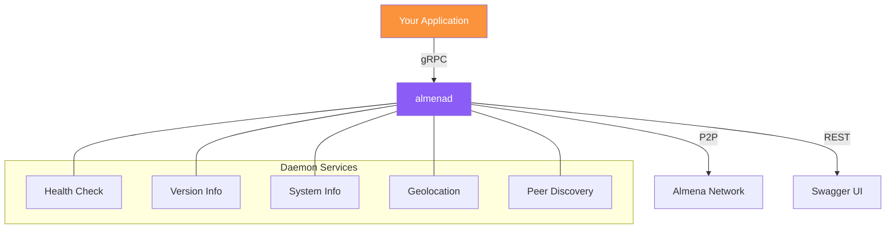
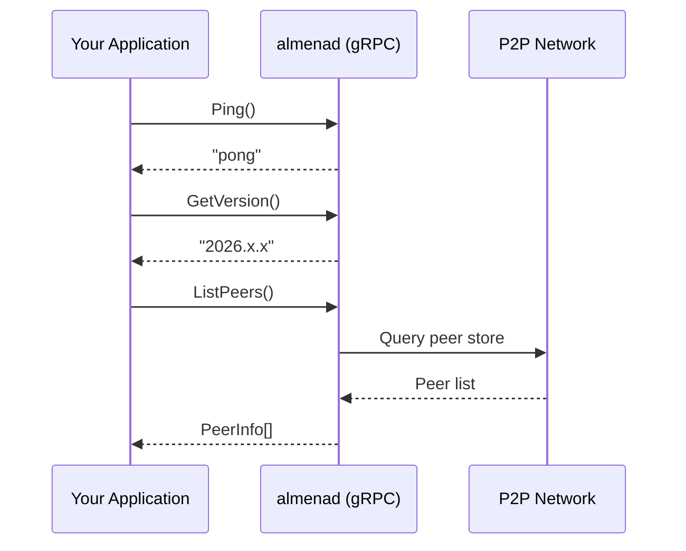

# Almena Network for Integrators

This section provides documentation for developers integrating their applications with the Almena Network platform.

## Integration Architecture

## Integration Points

Almena Network exposes two APIs through its daemon service (`almenad`):

### gRPC API (Primary)

The gRPC API is the primary integration point. Default endpoint: `[::1]:50051`.

| Capability | RPC Method | Description |
|-----------|------------|-------------|
| **Health Check** | `Ping` | Verify the daemon is running and responsive |
| **Version Info** | `GetVersion` | Query the daemon version programmatically |
| **System Info** | `GetSystemInfo` | Retrieve OS name and version from the host |
| **Geolocation** | `GetGeolocation` | Get the node's public IP geolocation (city, country, coordinates) |
| **Peer Discovery** | `ListPeers` | List all discovered P2P peers with connection status and network type |

### REST API (Secondary)

A lightweight REST API with Swagger UI for quick status checks. Default endpoint: `127.0.0.1:8080`.

| Endpoint | Description |
|----------|-------------|
| `GET /status` | Daemon status, version, gRPC/REST addresses |
| `GET /api/v1/status` | Same as above (versioned) |
| `GET /swagger-ui/` | OpenAPI 3.0 interactive documentation |

### Integration Guides

- [**Daemon Setup**](./daemon-setup) — Install and run the Almena daemon on your system.
- [**gRPC API Reference**](./grpc-api) — Complete reference for all available RPC methods and message types.

## Protocol & Standards

Almena Network follows W3C standards. Identity (DIDs, VCs) is one of its current focus areas:

- **DIDs** ([Decentralized Identifiers](https://www.w3.org/TR/did-1.0/)) v1.0
- **Verifiable Credentials** ([Data Model](https://www.w3.org/TR/vc-data-model-2.0/)) v2.0
- **DIDComm** v2 for secure messaging

The gRPC API uses Protocol Buffers (proto3) as the wire format. The canonical proto definition lives in the daemon repository at `proto/almena/daemon/v1/service.proto`.

## Connection Flow

:::info Coming Soon
Credential issuance, presentation verification, and trust framework APIs will be added as they are implemented.
:::
