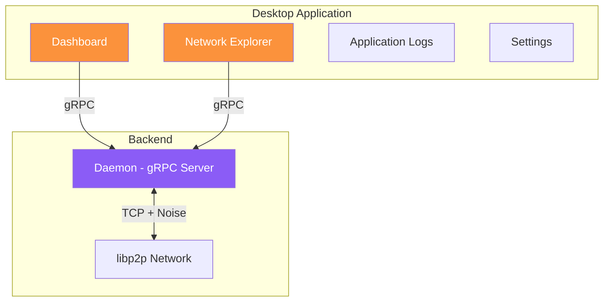
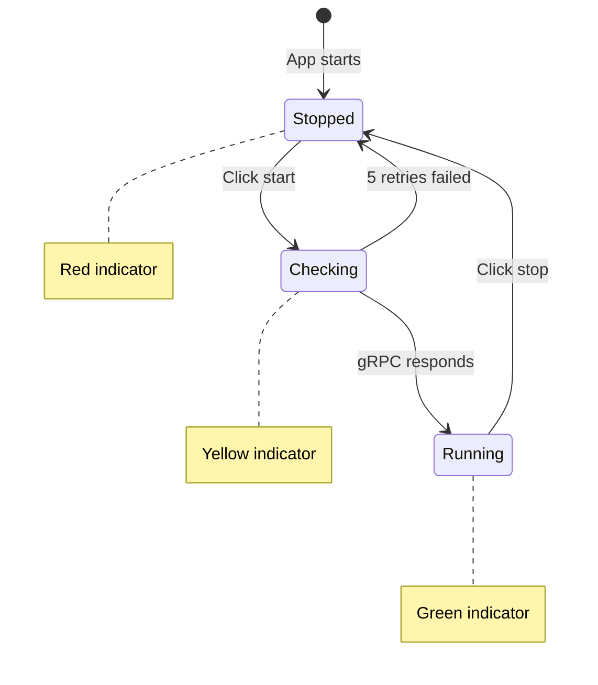

# Desktop: Network Explorer

The Almena Desktop application is an administration console for organizations participating in the Almena Network. It includes a Network Explorer that provides a real-time view of the peer-to-peer network.

## Application Overview

## Getting Started

1. Open the Almena Desktop application.
2. The header shows the **Daemon Status** — ensure it is running (green indicator).
3. Navigate between sections using the **bottom dock** (macOS-style floating navigation).

## Dashboard

The Dashboard provides an overview of your node:

- **Daemon status** — Running or stopped, with version information.
- **Node ID** — Your peer identifier in the P2P network.
- **Public IP** — Your node's public IP address.
- **World map** — Interactive map showing your node (orange marker) and peer nodes (violet markers) at their geographic positions.

The dashboard polls the daemon every 5 seconds for real-time updates.

## Network Explorer

The Network page displays all discovered peers in a detailed list:

| Column | Description |
|--------|-------------|
| **Peer ID** | Truncated identifier (first 12 characters) |
| **Status** | Green dot = connected, Gray dot = disconnected |
| **Network** | LAN (local network) or Internet |
| **Location** | City and country based on IP geolocation |
| **Addresses** | Number of network addresses |

Your own node is marked with a **"This node"** badge.

## Daemon Control

The **Daemon Status Button** in the header controls the background service:

- **Red dot** — Daemon is stopped. Click to start.
- **Green dot** — Daemon is running. Click to stop.
- **Yellow dot** — Checking daemon status (retries up to 5 times with 500ms delay).

## Application Logs

The Logs page displays the desktop application's rotating log files:

- Filters for `almena-desktop.log` and date-stamped files.
- Manual refresh button.
- Auto-scrolls to the bottom for the latest entries.

## Current Limitations

- Peer discovery is limited to **local network (LAN)** via mDNS. Internet peer discovery requires bootstrap nodes.
- Geolocation data is fetched from a public API (ipapi.co) and requires internet access.
- Settings management is under development.
