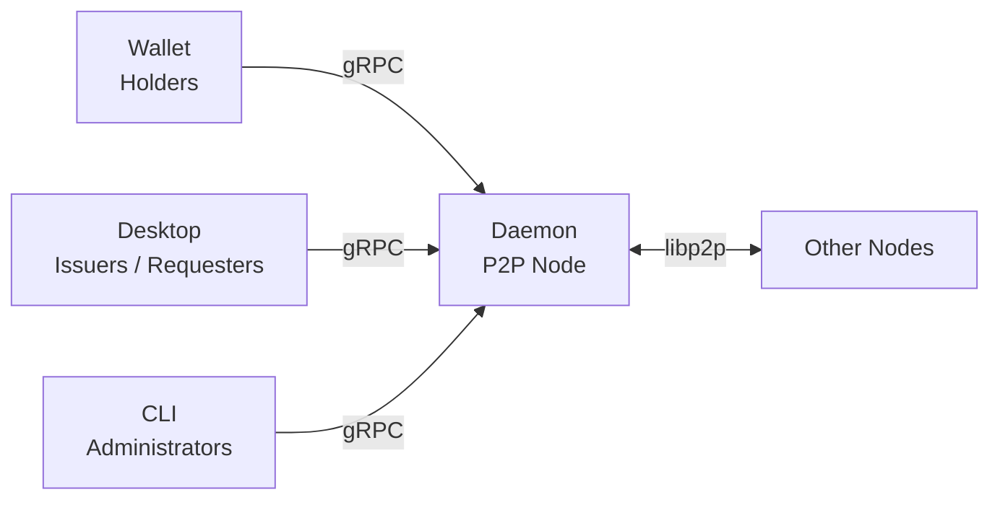

# Almena Network for Users

Almena Network is a decentralized platform. Identity is one of its core capabilities: you can create and manage your digital identity (DID) and credentials without central gatekeepers. Unlike traditional systems where a company owns your account, here **you own your identity**.

## What is Almena Network?

Almena Network is built on open standards ([W3C](https://www.w3.org/)) and consists of two main applications:

- **Wallet** — Your personal identity wallet where you create and manage your decentralized identity (DID). Designed as a mobile-first experience.
- **Desktop** — An administration console for organizations that issue or request verifiable credentials.

Both applications connect to a background service called the **Daemon**, which handles peer-to-peer networking and communication between nodes.

## Roles in the Network

| Role | Application | Description |
|------|------------|-------------|
| **Holder** | Wallet | Individuals who own and control their digital identity and credentials |
| **Issuer** | Desktop | Organizations that create and sign verifiable credentials |
| **Requester** | Desktop | Organizations that request and verify credentials |
| **Administrator** | CLI / Desktop | Manages daemon nodes and network infrastructure |

## Available Features

### Wallet

The wallet provides a complete identity management experience:

- **Account creation** — 6-step guided onboarding to create your decentralized identity (DID).
- **Password protection** — Secure password with real-time validation (8+ characters, uppercase, lowercase, digits).
- **Identity generation** — Automatic DID creation with cryptographic key derivation.
- **Biometric authentication** — Optional fingerprint or Face ID setup for quick unlock.
- **Cloud backup** — Encrypted backup to Google Drive or iCloud for identity recovery.
- **Account recovery** — Full 6-step recovery flow to restore your identity from a cloud backup.
- **Lock screen** — Biometric or password-based lock with inactivity timeout.
- **QR code scanning** — Scan QR codes for credential exchange.
- **Multi-language** — Available in English and Spanish.

### Desktop (Admin Console)

The desktop application provides tools for network administration:

- **Network Explorer** — Interactive world map showing connected peers in the P2P network, with real-time connection status and geolocation data.
- **Daemon Control** — Start, stop, and monitor the background daemon service directly from the interface.
- **Application Logs** — View and filter rotating log files from the desktop application.
- **Multi-language** — Available in English and Spanish, auto-detected from your system language.

## Getting Started

Choose your application to get started:

- [**Wallet — Getting Started**](./wallet-getting-started) — Create your first identity.
- [**Wallet — Recovery**](./wallet-recovery) — Restore an existing identity from a cloud backup.
- [**Desktop — Network Explorer**](./desktop-network) — Explore the peer-to-peer network.
