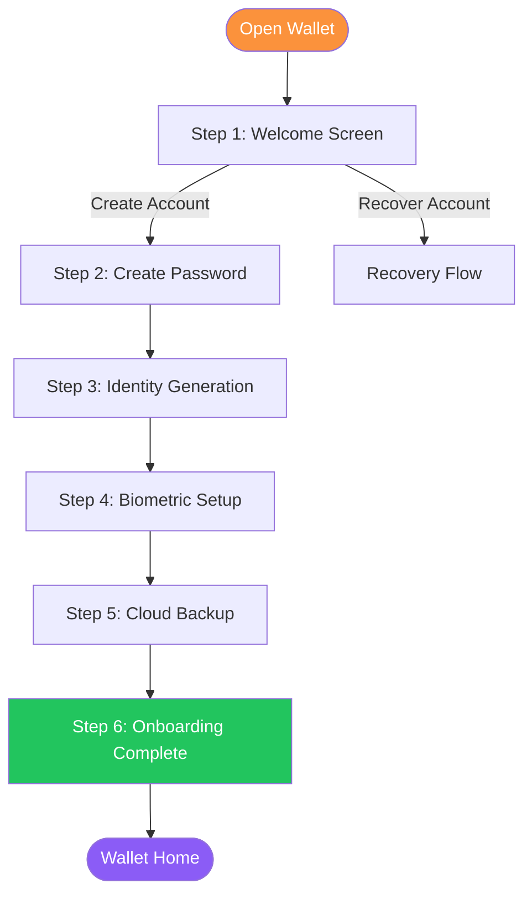
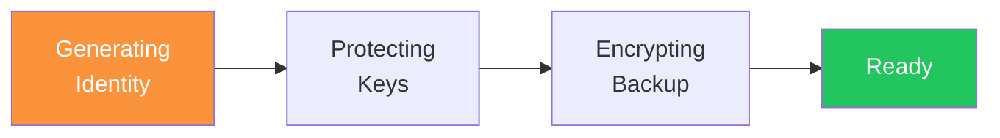
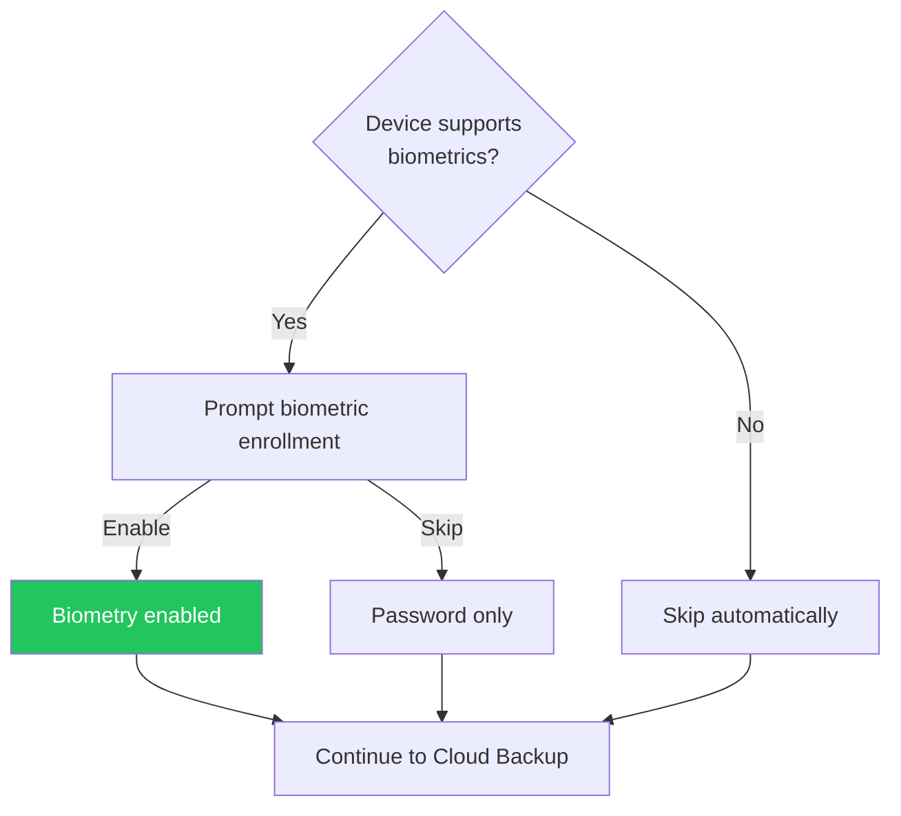

# Wallet: Getting Started

The Almena Wallet is your personal identity application. It allows you to create and manage your decentralized identity (DID) on your own device through a guided 6-step onboarding process.

## Onboarding Overview

## Step 1: Welcome Screen

When you open the wallet for the first time, you will see the welcome screen with two options:

- **Create Account** — Start fresh with a new decentralized identity.
- **Recover Account** — Restore an existing identity from a cloud backup (see [Wallet: Recovery](../wallet-recovery)).

Tap **Create Account** to begin the onboarding process.

## Step 2: Create Password

You will be asked to create a secure password that protects your identity on this device. The wallet validates your password in real time with the following rules:

- Minimum **8 characters**
- At least one **uppercase** letter (A-Z)
- At least one **lowercase** letter (a-z)
- At least one **digit** (0-9)

Each rule shows a visual indicator as you type — a checkmark appears when a rule is satisfied. You must confirm the password by entering it again. You can toggle password visibility using the show/hide button on each field.

:::warning Important
This password is used to encrypt your private keys locally. There is no "forgot password" option. If you lose this password and have no cloud backup, your identity cannot be recovered.
:::

## Step 3: Identity Generation

After setting your password, the wallet automatically generates your decentralized identity. This process includes several stages:

1. **Generating identity** — Creates a unique DID using P-256 ECDSA cryptographic keys.
2. **Protecting keys** — Derives encryption keys from your password using Argon2.
3. **Encrypting backup** — Prepares two encrypted backup blobs (one for local use, one for cloud storage).
4. **Ready** — Your identity is created and ready to use.

All of this happens locally on your device — no data is sent to any server.

## Step 4: Biometric Setup

If your device supports biometric authentication (fingerprint or Face ID), you will be prompted to enable it.

- **Enable biometrics** — Allows you to unlock the wallet quickly using your fingerprint or face. Recommended for convenience.
- **Skip** — Continue with password-only authentication. You can enable biometrics later from settings.

## Step 5: Cloud Backup

The wallet offers encrypted cloud backup to protect your identity against device loss.

**Available providers:**
- Google Drive
- iCloud

**How it works:**

1. Choose a cloud provider from the available options.
2. Authenticate with the provider (opens a secure login flow).
3. The wallet uploads an **encrypted** backup of your identity.

:::info
The backup is encrypted with your password before it leaves your device. The cloud provider cannot read your identity data. Only someone with your password can decrypt it.
:::

You can skip this step, but a warning will remind you that without a backup, losing your device means losing your identity.

## Step 6: Onboarding Complete

The completion screen shows a summary of your new identity:

- **Your DID** — Your unique decentralized identifier (with a copy button).
- **Checklist** — Status of each setup step:
  - Identity created
  - Biometry enabled / skipped
  - Cloud backup completed / skipped

Tap **Enter Wallet** to access your wallet home screen.

## After Onboarding

### Wallet Home

Your wallet home screen displays:

- Your truncated DID with a copy button.
- Number of identity contexts.
- Biometry status.

### Lock Screen

If biometric authentication is enabled, the wallet locks automatically:

- After **30 seconds** in the background.
- After **5 minutes** of inactivity.

You can unlock with your fingerprint, Face ID, or password.

### Available Actions

- **Scan** — Scan QR codes for credential exchange.
- **Messages** — View credential-related messages.
- **Settings** — Manage wallet preferences.
- **Logout** — Reset the wallet and remove all local data.

## Technical Details

- The wallet runs as a native application built with [Tauri](https://tauri.app/) — available on desktop, Android, and iOS.
- Private keys are encrypted using AES-256-GCM with Argon2-derived keys.
- Cloud backups use XChaCha20-Poly1305 encryption.
- No data is sent to any server during account creation — everything happens locally on your device.
- The interface is optimized for a mobile-first experience (390x844 viewport).
