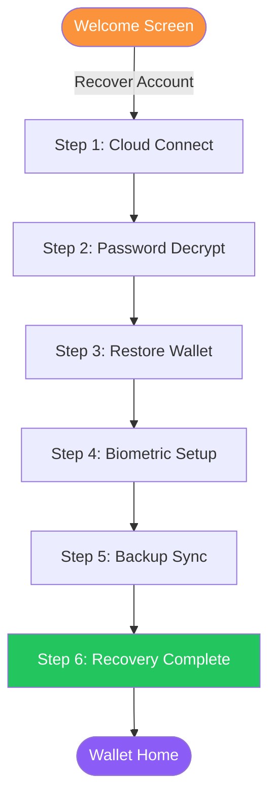

# Wallet: Recovery

If you have lost access to your device or need to restore your identity on a new one, the Almena Wallet provides a 6-step recovery flow using your encrypted cloud backup.

## Prerequisites

To recover your identity, you need:

- A **cloud backup** created during onboarding (Google Drive or iCloud).
- Your **password** used when the identity was originally created.

## Recovery Overview

## Step 1: Cloud Connect

1. Select the cloud provider where your backup is stored (Google Drive or iCloud).
2. Authenticate with the provider.
3. The wallet searches for and downloads your encrypted backup.

If no backup is found, verify you are using the correct cloud account.

## Step 2: Password Decrypt

Enter the password you used when you originally created your identity. The wallet uses this password to decrypt the backup data.

:::warning
If you have forgotten your password, the backup cannot be decrypted. There is no password recovery mechanism — this is by design to protect your identity.
:::

## Step 3: Restore Wallet

The wallet restores your identity from the decrypted backup. This process includes:

1. **Verify root identity** — Validates the root DID and cryptographic keys.
2. **Generate device keys** — Creates new device-specific key pairs.
3. **Restore contexts** — Rebuilds all identity contexts and associated credentials.
4. **Rebuild local store** — Reconstructs the local encrypted storage.

Progress is displayed in real time during restoration.

## Step 4: Biometric Setup

Same as during onboarding — you can enable fingerprint or Face ID for quick unlock, or skip this step.

## Step 5: Backup Sync

After restoration, the wallet syncs the updated state back to your cloud provider. This ensures the backup reflects any device-specific changes (e.g., new device keys).

## Step 6: Recovery Complete

The completion screen shows your restored identity:

- **Your DID** — Confirmed to match the original identity.
- **Checklist** — Status of each recovery step.

Tap **Enter Wallet** to access your restored wallet.

## Security Considerations

- Recovery sessions have a **10-minute timeout** — if idle too long, the session clears and you must start over.
- The wallet confirms before exiting during critical recovery steps to prevent accidental data loss.
- All decryption happens locally on your device.
