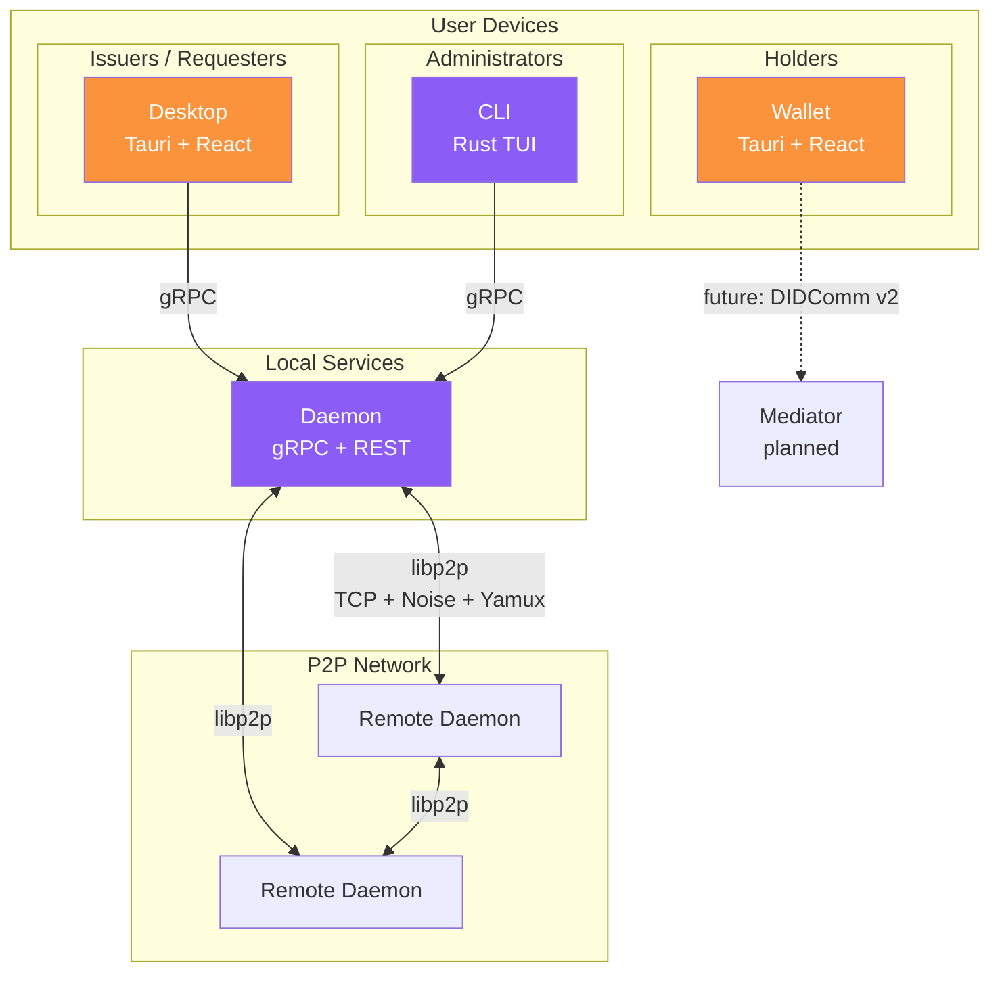
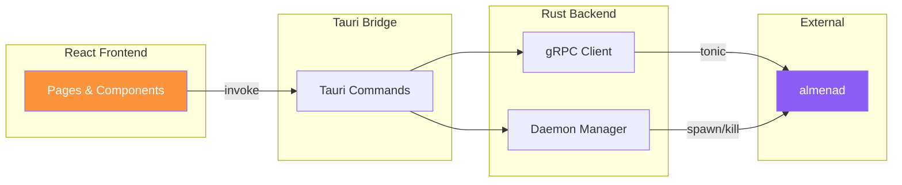
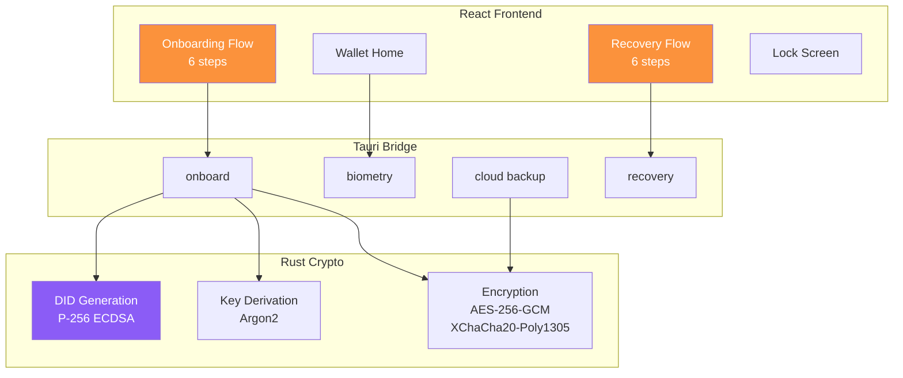
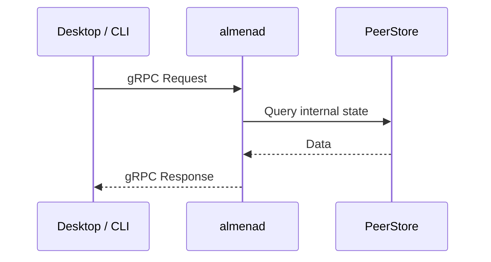
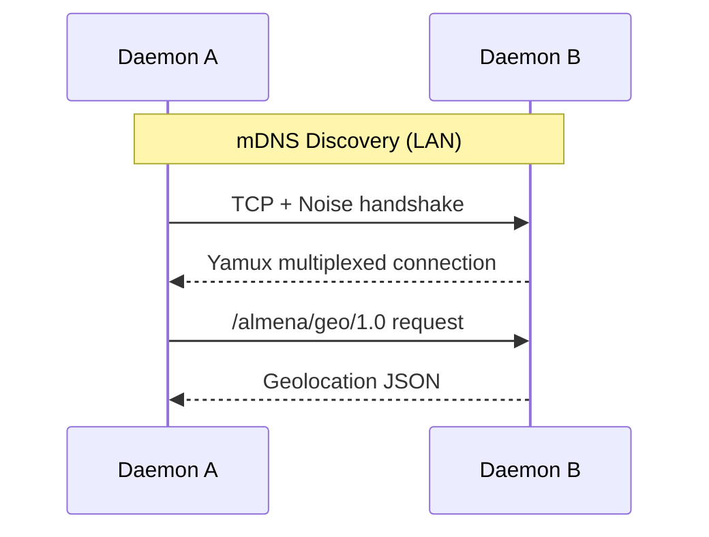
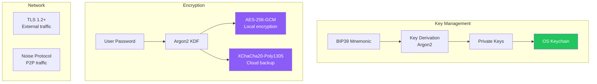

# Arquitectura

Almena Network sigue una arquitectura modular donde cada componente tiene una responsabilidad clara y se comunica a traves de interfaces bien definidas.

## Vision General del Sistema

## Componentes

### Daemon (`almenad`)

El daemon es el servicio principal en segundo plano que se ejecuta en cada nodo. Es el **unico componente que participa en la red P2P**.

**Responsabilidades:**
- Exponer la API gRPC para clientes locales (desktop, CLI)
- Exponer la REST API con Swagger UI para verificaciones de estado
- Gestionar conexiones P2P via libp2p
- Descubrir peers en la red local (mDNS)
- Intercambiar datos de geolocalizacion con peers via protocolo personalizado (`/almena/geo/1.0`)
- Proveer datos de geolocalizacion para la visualizacion de la red

**Tecnologia:** Rust, tonic 0.12, libp2p 0.56, axum 0.8, tokio

**Estructura del codigo fuente:**

| Archivo | Proposito |
|---------|-----------|
| `main.rs` | Servidor gRPC, implementacion del servicio |
| `p2p.rs` | Swarm de libp2p, descubrimiento de peers, intercambio de geolocalizacion |
| `rest.rs` | Router REST con Axum, Swagger UI |
| `geolocation.rs` | Serializacion de cache de geolocalizacion |
| `path.rs` | Directorios de datos especificos de plataforma |

### Desktop

La aplicacion de escritorio es una consola de administracion disenada para **Issuers** (entidades que emiten credenciales) y **Requesters** (entidades que solicitan presentaciones de credenciales).

**Responsabilidades:**
- Visualizar la red P2P en un mapa mundial interactivo
- Controlar el ciclo de vida del daemon (iniciar/detener)
- Mostrar el dashboard del nodo con estado en tiempo real
- Ver y filtrar logs de la aplicacion
- Proveer una interfaz de gestion de organizaciones

**Tecnologia:** Tauri v2, React 19, TypeScript, tonic (cliente gRPC en Rust)

**Arquitectura:**

### Wallet

El wallet es una aplicacion mobile-first para **Holders** — individuos que poseen y gestionan su identidad digital (una de las capacidades centrales de la plataforma).

**Responsabilidades:**
- Crear y gestionar identidades descentralizadas (DIDs)
- Almacenar claves privadas de forma segura usando AES-256-GCM con derivacion de claves Argon2
- Proveer autenticacion biometrica (huella dactilar, Face ID)
- Gestionar respaldos cifrados en la nube (Google Drive, iCloud)
- Soportar recuperacion completa de identidad desde respaldos en la nube
- Escaneo de codigos QR para intercambio de credenciales

**Tecnologia:** Tauri v2, React 19, TypeScript

**Arquitectura:**

### CLI

El CLI proporciona una interfaz de terminal para la gestion y monitoreo del daemon.

**Responsabilidades:**
- Iniciar, detener y hacer ping al daemon
- Mostrar el estado del daemon en tiempo real (polling cada 2 segundos)
- Proveer una alternativa basada en texto a la app de escritorio

**Tecnologia:** Rust, ratatui 0.29, crossterm 0.28, tonic (cliente gRPC)

## Patrones de Comunicacion

### Comunicacion Local (gRPC)

Desktop y CLI se comunican con el daemon via **gRPC** en la maquina local:

El archivo proto en `daemon/proto/almena/daemon/v1/service.proto` es la **unica fuente de verdad**. Los clientes copian y generan codigo a partir de este archivo.

### Comunicacion P2P (libp2p)

Los daemons se descubren y comunican entre si a traves de la red P2P:

| Capa | Tecnologia | Detalles |
|------|-----------|----------|
| Transporte | TCP | IPv4 + IPv6 |
| Cifrado | Noise | Todo el trafico cifrado |
| Multiplexacion | Yamux | Multiples streams por conexion |
| Descubrimiento | mDNS | Peers en LAN, intervalo de 5 segundos |
| Protocolo personalizado | `/almena/geo/1.0` | Intercambio de geolocalizacion entre peers |

Cada daemon mantiene un `PeerStore` — un mapa thread-safe de peers descubiertos con su estado de conexion.

### Comunicacion del Wallet

El wallet actualmente opera de forma independiente sin gRPC del daemon. Las operaciones de DID y credenciales ocurren localmente en el backend Rust de Tauri.

## Almacenamiento de Datos

### Directorios por Plataforma

Cada modulo almacena datos en ubicaciones especificas de la plataforma:

| Modulo | macOS | Linux |
|--------|-------|-------|
| Daemon | `~/Library/Application Support/network.almena.daemon` | `~/.local/share/network.almena.daemon` |
| CLI | `~/Library/Application Support/network.almena.cli` | `~/.local/share/network.almena.cli` |
| Wallet | Tauri plugin-store (directorio de datos de la app) | Tauri plugin-store |

En modo de desarrollo, todos los modulos usan un directorio local `./workspace/`.

### Modelo de Seguridad

| Proposito | Tecnologia |
|-----------|-----------|
| **Firma** | P-256 ECDSA (wallet), Ed25519 (daemon) |
| **Acuerdo de claves** | X25519 (ECDH) |
| **Cifrado simetrico** | AES-256-GCM (local), XChaCha20-Poly1305 (respaldo) |
| **Derivacion de claves** | Argon2 (contrasena), BIP39 + BIP32 (mnemonic) |
| **Hashing** | SHA-256 |
| **Red** | TLS 1.2+ (externo), Noise protocol (P2P) |

## Sistema de Diseno

Todas las aplicaciones frontend (desktop y wallet) comparten un sistema de diseno **glassmorphism**:

| Token | Valor |
|-------|-------|
| Color primario | `#FB923C` (naranja) |
| Color secundario | `#8B5CF6` (violeta) |
| Fondo | `#0c0a09` (oscuro profundo) |
| Efecto glass | `rgba(255,255,255,0.05)` + `backdrop-filter: blur(12px)` |
| Border radius | 8-12px |
| Espaciado base | 8px |
| Transiciones | 200-250ms ease-out |
| Tipografia | Inter, Outfit, o sans-serif geometrica similar |
| Navegacion | Dock flotante (estilo macOS, centrado abajo) |
