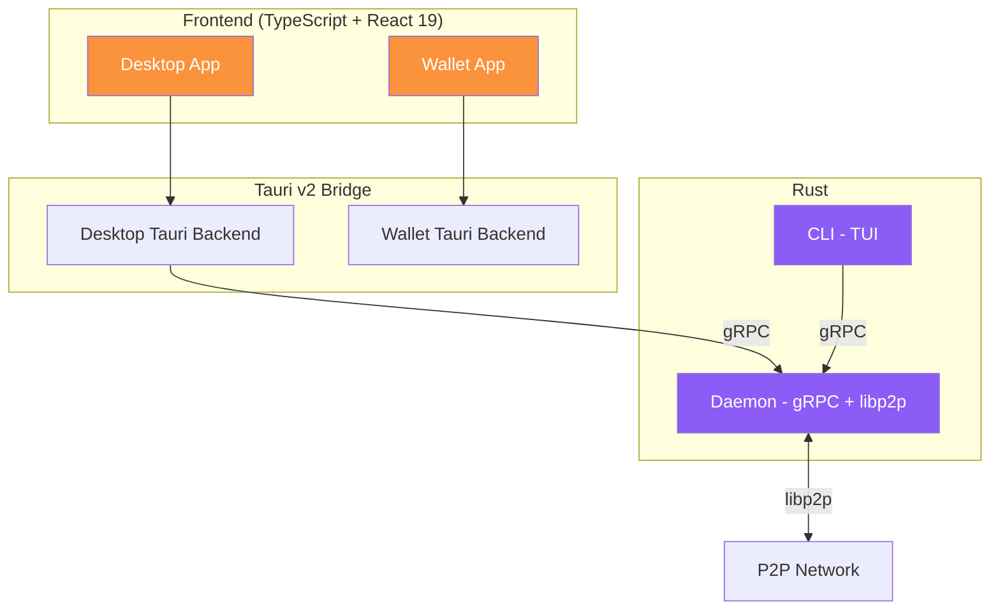

# Almena Network para Desarrolladores

Documentacion para los miembros del equipo que desarrollan los modulos de la plataforma Almena Network.

## Vision General de la Plataforma

Almena Network es una plataforma descentralizada construida sobre estándares W3C. La identidad (DIDs, Verifiable Credentials) es una de sus capacidades centrales; capacidades futuras incluyen aplicaciones descentralizadas, persistencia, mensajería, coordinación y consenso, y tiempo/ordenamiento. El proyecto está organizado como un **monorepo con git submodules**, donde cada módulo es un repositorio independiente que sigue la rama `develop`.

## Modulos

| Modulo | Tecnologia | Descripcion | Estado |
|--------|-----------|-------------|--------|
| [**Daemon**](./modules/daemon) | Rust, tonic, libp2p | Servidor gRPC y red P2P | 5 RPCs, descubrimiento mDNS, REST API |
| [**Desktop**](./modules/desktop) | Tauri v2, React 19, TypeScript | Consola de administracion para Issuers/Requesters | Dashboard, Mapa de red, Logs |
| [**Wallet**](./modules/wallet) | Tauri v2, React 19, TypeScript | Wallet de identidad mobile-first para Holders | Onboarding de 6 pasos, recuperacion, biometria, respaldo en la nube |
| [**CLI**](./modules/cli) | Rust, ratatui, crossterm | Interfaz de terminal para el daemon | TUI con gestion del daemon |
| **Docs** | Docusaurus 3 | Sitio de documentacion (este sitio) | EN + ES |

## Enlaces Rapidos

- [**Primeros Pasos**](./getting-started) — Configura tu entorno de desarrollo.
- [**Arquitectura**](./architecture) — Arquitectura del sistema y decisiones de diseno.
- [**Guias de Modulos**](./modules/daemon) — Profundiza en la implementacion de cada modulo.

## Stack Tecnologico

| Capa | Tecnologia |
|------|-----------|
| Frontend | React 19, TypeScript 5.8, Vite 7 |
| Framework de escritorio | Tauri v2 |
| Backend | Rust 2021 edition |
| gRPC | tonic 0.12, prost 0.13 |
| P2P | libp2p 0.56 |
| CLI TUI | ratatui 0.29, crossterm 0.28 |
| Gestores de paquetes | pnpm (Node), cargo (Rust) |
| Task runner | [Taskfile](https://taskfile.dev/) |
| Documentacion | Docusaurus 3 |

## Esquema de Versionado

Todos los modulos siguen un versionado basado en fechas: `YYYY.MM.DD[-variant]`

Ejemplos: `2026.3.5-alpha`, `2026.1.1-develop`
