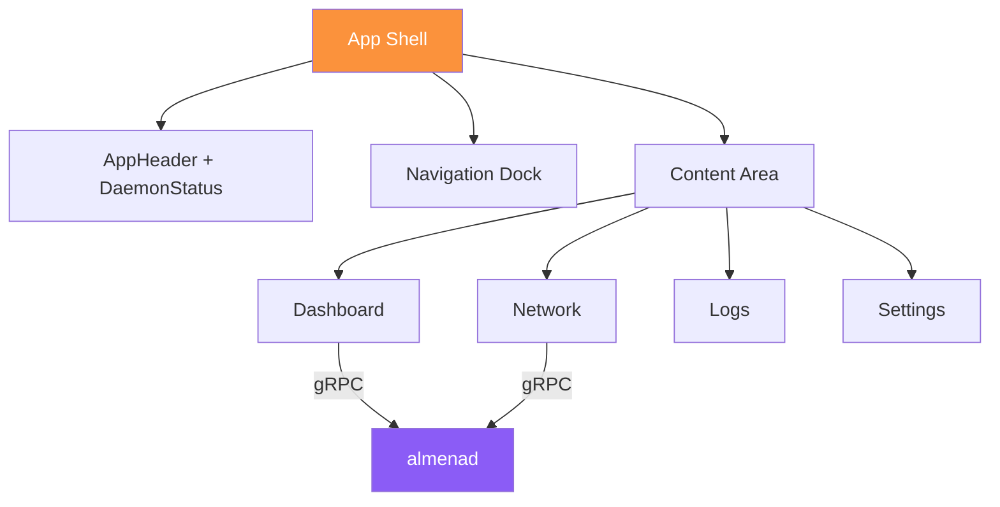

# Modulo: Desktop

La aplicacion de escritorio es la consola de administracion para organizaciones que actuan como **Issuers** (emisores de credenciales) y **Requesters** (verificadores de credenciales).

## Vision General

| Propiedad | Valor |
|-----------|-------|
| Identificador de app | `network.almena.desktop.dev` |
| Framework | Tauri v2 + React 19 |
| Version | `2026.3.5-alpha` |
| Tamano de ventana | 1440x900 (min 1024x768) |
| Repositorio | `almena-network/desktop` |

## Estructura del Codigo Fuente

```
desktop/
├── src/                          # React frontend
│   ├── main.tsx                  # Entry point
│   ├── App.tsx                   # Navigation and routing
│   ├── App.css                   # Design tokens (glassmorphism)
│   ├── components/
│   │   ├── AppHeader.tsx         # Top bar with daemon status
│   │   ├── DaemonStatusButton.tsx # Start/stop daemon control
│   │   ├── Dock.tsx              # Bottom navigation with SVG icons
│   │   └── Footer.tsx            # Version and GitHub link
│   ├── pages/
│   │   ├── Dashboard.tsx         # Node overview + world map
│   │   ├── Network.tsx           # Peer list with status
│   │   ├── Logs.tsx              # Application log viewer
│   │   └── Settings.tsx          # Placeholder
│   └── i18n/                     # English and Spanish translations
│
├── src-tauri/                    # Rust backend
│   ├── src/
│   │   ├── main.rs               # Tauri entry point
│   │   ├── lib.rs                # Tauri commands
│   │   ├── grpc.rs               # gRPC client to daemon
│   │   └── daemon.rs             # Daemon process management
│   ├── proto/                    # Proto files (copied from daemon)
│   ├── tauri.conf.json           # App configuration
│   └── Cargo.toml                # Rust dependencies
│
├── package.json                  # Node dependencies
├── vite.config.ts                # Vite configuration
└── Taskfile.yml                  # Task orchestration
```

## Flujo de la Aplicacion



## Funcionalidades Implementadas

### Dashboard

- Estado del daemon, version e ID del nodo
- IP publica e informacion de geolocalizacion
- **Mapa mundial** interactivo (react-simple-maps) centrado en el nodo local
- Marcadores de peers: naranja (nodo local, 6px), violeta (peers, 4px)
- Polling en tiempo real cada 5 segundos

### Explorador de Red

- Lista de peers mostrando: Peer ID truncado, estado de conexion, tipo LAN/Internet, geolocalizacion, cantidad de direcciones
- Nodo local marcado con insignia "This node"
- Auto-refresco cada 5 segundos

### Logs de Aplicacion

- Visor de archivos de log rotados (`almena-desktop.log` y archivos con fecha)
- Boton de refresco manual
- Auto-scroll a las entradas mas recientes

### Control del Daemon

- Boton de estado en el header: rojo (detenido), verde (ejecutando), amarillo (verificando)
- Clic para iniciar/detener el proceso del daemon
- Logica de reintento: 5 intentos con delays de 500ms al iniciar

### Internacionalizacion

- Idiomas soportados: ingles (en), espanol (es)
- Deteccion automatica de la preferencia de idioma del SO
- Claves de recursos organizadas por dominio: `app.*`, `nav.*`, `daemon.*`, `network.*`

## Comandos Tauri

Comandos expuestos al frontend React via `invoke()`:

| Comando | Retorna | Descripcion |
|---------|---------|-------------|
| `start_daemon()` | `Result<String>` | Iniciar el proceso del daemon |
| `stop_daemon()` | `Result<String>` | Detener el proceso del daemon |
| `list_peers()` | `Result<Vec<PeerInfoJson>>` | Obtener peers del daemon |
| `get_geolocation()` | `Result<GeolocationJson>` | Obtener geolocalizacion del nodo |

## Integracion gRPC

El backend Rust (`src-tauri/src/grpc.rs`) actua como puente entre el frontend React y el daemon:

1. React llama a `invoke("list_peers")` via Tauri IPC
2. El handler Rust se conecta al daemon en `DAEMON_GRPC_URL` (por defecto: `http://[::1]:50051`)
3. La respuesta gRPC se convierte a structs serializables en JSON
4. La respuesta JSON se retorna a React

## Gestion del Proceso del Daemon

La app de escritorio gestiona el ciclo de vida del daemon de forma diferente en desarrollo vs produccion:

| Modo | Iniciar | Detener |
|------|---------|---------|
| **Desarrollo** | Lanza el binario desde `ALMENAD_DIR` | Mata el proceso por PID |
| **macOS** | `launchctl load ...plist` | `launchctl unload ...plist` |
| **Linux** | `systemctl --user start almenad` | `systemctl --user stop almenad` |
| **Windows** | `sc start AlmenaD` | `sc stop AlmenaD` |

## Desarrollo

```bash
# Instalar dependencias
task install

# Ejecutar en modo desarrollo (inicia Vite + Tauri)
task dev

# Verificacion de tipos
task check

# Compilar para produccion
task build

# Previsualizar frontend compilado
task preview
```

### Variables de Entorno

| Variable | Valor por defecto | Descripcion |
|----------|-------------------|-------------|
| `DAEMON_GRPC_URL` | `http://[::1]:50051` | Endpoint gRPC del daemon |
| `ALMENAD_DIR` | `../../daemon/target/debug` | Ruta al binario del daemon (modo desarrollo) |

### Flujo de Proto

Despues de cambios en el proto del daemon:

```bash
task proto:copy     # Copiar proto desde el daemon
task proto:client   # Reconstruir cliente gRPC
```

## Implementacion Pendiente

- **Settings** — Pagina placeholder
- Flujos de **emision de credenciales**
- Manejo de **solicitudes de presentacion**
- UI de **gestion de organizaciones**
