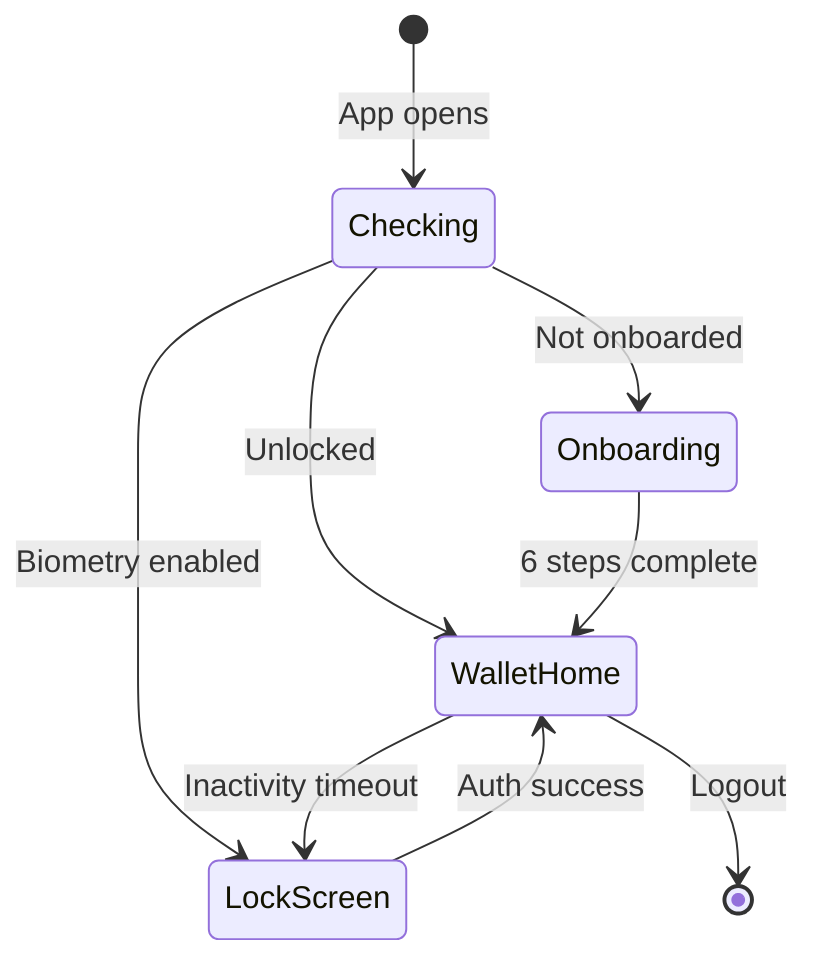
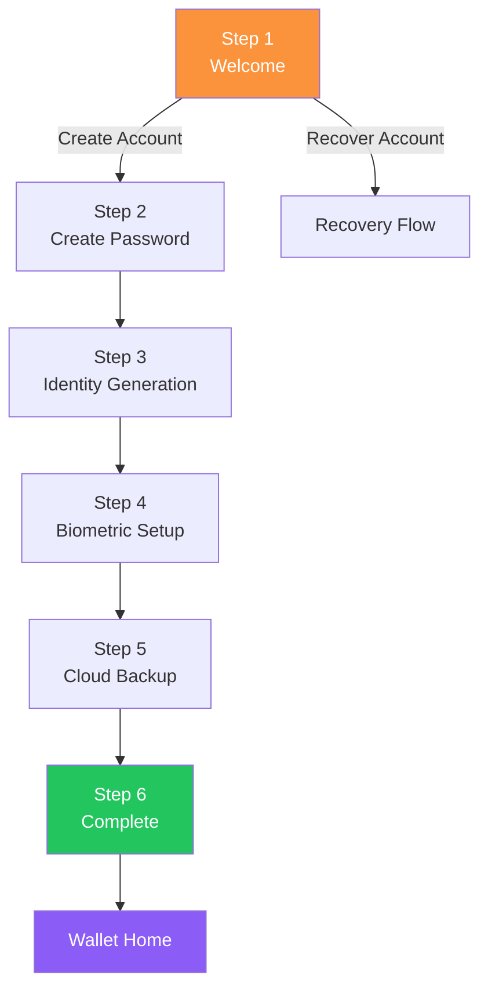
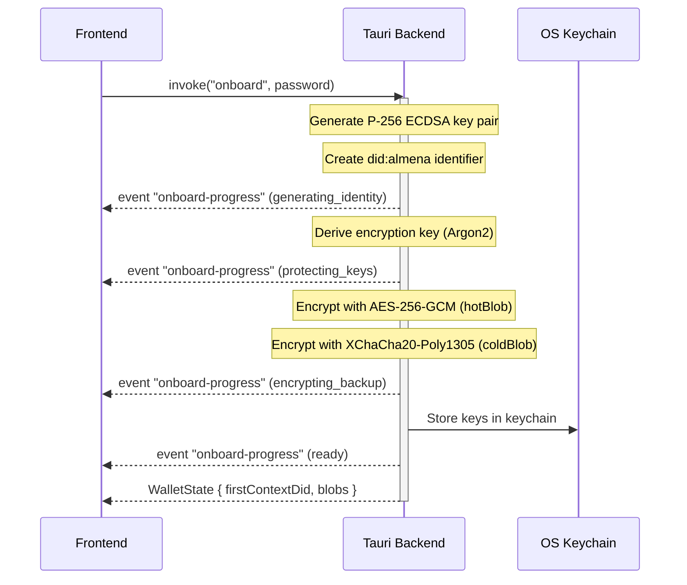
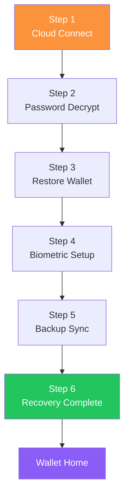

# Modulo: Wallet

El wallet es una aplicacion mobile-first para **Holders** — individuos que crean y gestionan su identidad descentralizada.

## Vision General

| Propiedad | Valor |
|-----------|-------|
| Identificador de app | `network.almena.wallet` |
| Framework | Tauri v2 + React 19 |
| Version | `2026.2.26` |
| Tamano de ventana | 390x844 (min 360x640, max 768x1024) |
| Repositorio | `almena-network/wallet` |
| Plataformas | Desktop, Android, iOS |

## Estructura del Codigo Fuente

```
wallet/
├── src/                              # React frontend
│   ├── main.tsx                      # Entry point
│   ├── App.tsx                       # Router + AppGate (state machine)
│   ├── i18n.ts                       # i18next setup (en, es)
│   ├── types/wallet.ts               # TypeScript interfaces
│   ├── lib/logger.ts                 # Debug logging
│   ├── locales/
│   │   ├── en.json                   # English translations
│   │   └── es.json                   # Spanish translations
│   ├── layouts/
│   │   └── WalletLayout.tsx          # Main layout with nav dock
│   ├── onboarding/
│   │   ├── OnboardingFlow.tsx        # 6-step onboarding orchestrator
│   │   └── onboardingReducer.ts      # Onboarding state machine
│   ├── recovery/
│   │   ├── RecoveryFlow.tsx          # 6-step recovery orchestrator
│   │   └── recoveryReducer.ts        # Recovery state machine
│   ├── pages/
│   │   ├── Onboarding.tsx            # Step 1: Welcome
│   │   ├── CreatePassword.tsx        # Step 2: Password
│   │   ├── IdentityGenerationScreen.tsx  # Step 3: DID generation
│   │   ├── BiometrySetupScreen.tsx   # Step 4: Biometrics
│   │   ├── CloudBackupScreen.tsx     # Step 5: Cloud backup
│   │   ├── OnboardingCompleteScreen.tsx  # Step 6: Summary
│   │   ├── LockScreen.tsx            # Biometric/password unlock
│   │   ├── wallet/
│   │   │   ├── WalletHome.tsx        # Main wallet view
│   │   │   ├── WalletScan.tsx        # QR scanner
│   │   │   ├── WalletMessages.tsx    # Messages/credentials
│   │   │   ├── WalletSettings.tsx    # Settings
│   │   │   └── WalletLogout.tsx      # Logout/reset
│   │   └── recovery/
│   │       ├── CloudConnectScreen.tsx     # Recovery step 1
│   │       ├── PasswordDecryptScreen.tsx  # Recovery step 2
│   │       ├── RestoreWalletScreen.tsx    # Recovery step 3
│   │       ├── BiometrySetupScreen.tsx    # Recovery step 4
│   │       ├── BackupSyncScreen.tsx       # Recovery step 5
│   │       └── RecoveryCompleteScreen.tsx # Recovery step 6
│
├── src-tauri/                        # Rust backend
│   ├── src/
│   │   ├── main.rs                   # Binary entry point
│   │   ├── lib.rs                    # Tauri command handlers
│   │   ├── onboarding.rs            # DID generation, key derivation, encryption
│   │   ├── recovery.rs              # Backup decryption, wallet restoration
│   │   ├── biometry.rs              # Biometric device integration
│   │   ├── cloud_backup.rs          # Cloud provider integration
│   │   ├── keystore.rs              # Secure key storage
│   │   └── wallet_state.rs          # Persistent wallet state
│   ├── tauri.conf.json
│   └── Cargo.toml
│
├── package.json
├── vite.config.ts
└── Taskfile.yml
```

## Maquina de Estados de la Aplicacion



El componente `AppGate` en `App.tsx` llama a `get_lock_screen_info` al montarse para determinar la ruta inicial.

## Enrutamiento

| Ruta | Componente | Descripcion |
|------|-----------|-------------|
| `/` | `AppGate` | Entrada de la maquina de estados — redirige a onboarding, lock o wallet |
| `/recover` | `RecoveryFlow` | Flujo de recuperacion de 6 pasos |
| `/wallet/home` | `WalletHome` | Vista principal del wallet con visualizacion del DID |
| `/wallet/scan` | `WalletScan` | Escaner de codigos QR |
| `/wallet/messages` | `WalletMessages` | Mensajes de credenciales |
| `/wallet/settings` | `WalletSettings` | Configuracion del usuario |
| `/wallet/logout` | `WalletLogout` | Cerrar sesion y reiniciar |

## Flujo de Onboarding (6 Pasos)



| Paso | Componente | Comando Tauri | Descripcion |
|------|-----------|---------------|-------------|
| 1 | `Onboarding` | — | Pantalla de bienvenida con opciones de crear/recuperar |
| 2 | `CreatePassword` | — | Contrasena con validacion (8+ caracteres, mayuscula, minuscula, digito) |
| 3 | `IdentityGenerationScreen` | `onboard(password)` | Creacion de DID, derivacion de claves, cifrado de respaldo |
| 4 | `BiometrySetupScreen` | `check_biometry_available`, `enable_biometry` | Huella dactilar/Face ID opcional |
| 5 | `CloudBackupScreen` | `get_available_cloud_providers`, `start_cloud_auth`, `upload_backup` | Respaldo cifrado en la nube |
| 6 | `OnboardingCompleteScreen` | `complete_onboarding(summary)` | Resumen del DID, checklist, entrar al wallet |

### Detalle de Generacion de Identidad



### Gestion de Estado

El flujo de onboarding usa un **patron reducer** (`onboardingReducer.ts`) con 6 pasos. El componente `OnboardingFlow` orquesta las transiciones entre pasos y proporciona:

- **Proteccion de salida** — Confirma antes de abandonar durante pasos criticos
- **Indicador de progreso** — Barra de progreso visual a traves de todos los pasos

## Flujo de Recuperacion (6 Pasos)



| Paso | Componente | Comando Tauri | Descripcion |
|------|-----------|---------------|-------------|
| 1 | `CloudConnectScreen` | `start_cloud_auth`, `search_backup`, `download_backup` | Buscar y descargar respaldo cifrado |
| 2 | `PasswordDecryptScreen` | `decrypt_backup(blob, password)` | Descifrar respaldo con la contrasena original |
| 3 | `RestoreWalletScreen` | `restore_wallet(payload)` | Restaurar DID, claves, contextos |
| 4 | `BiometrySetupScreen` | `check_biometry_available`, `enable_biometry` | Re-registrar biometria |
| 5 | `BackupSyncScreen` | `sync_updated_backup` | Sincronizar estado actualizado en la nube |
| 6 | `RecoveryCompleteScreen` | `complete_recovery` | Resumen y entrar al wallet |

Las sesiones de recuperacion tienen un **timeout de inactividad de 10 minutos** que limpia la sesion y regresa a la pantalla de bienvenida.

## Comandos Tauri

### Onboarding

| Comando | Parametros | Retorna | Descripcion |
|---------|-----------|---------|-------------|
| `onboard` | `password: string` | `WalletState` | Generar DID, derivar claves, cifrar respaldos |
| `complete_onboarding` | `WalletSummary` | `void` | Finalizar onboarding |
| `is_onboarding_complete` | — | `bool` | Verificar estado del onboarding |

### Biometria

| Comando | Parametros | Retorna | Descripcion |
|---------|-----------|---------|-------------|
| `check_biometry_available` | — | `BiometryInfo` | Verificar soporte del dispositivo |
| `enable_biometry` | — | `bool` | Registrar autenticacion biometrica |

### Respaldo en la Nube

| Comando | Parametros | Retorna | Descripcion |
|---------|-----------|---------|-------------|
| `get_available_cloud_providers` | — | `CloudProvider[]` | Listar proveedores |
| `start_cloud_auth` | `provider: string` | `bool` | Autenticar con el proveedor |
| `upload_backup` | `cold_blob: string` | `UploadResult` | Subir respaldo cifrado |
| `search_backup` | `provider: string` | `BackupSearchResult` | Buscar respaldo existente |
| `download_backup` | `fileId, provider` | `bytes` | Descargar blob de respaldo |
| `sync_updated_backup` | `...` | `SyncResult` | Sincronizar despues de la restauracion |

### Recuperacion

| Comando | Parametros | Retorna | Descripcion |
|---------|-----------|---------|-------------|
| `decrypt_backup` | `blob, password` | `RecoveryPayload` | Descifrar respaldo |
| `restore_wallet` | `RecoveryPayload` | `RestorationResult` | Restaurar identidad |
| `clear_recovery_session` | — | `void` | Limpiar sesion |
| `complete_recovery` | `...` | `void` | Finalizar recuperacion |

### Estado del Wallet

| Comando | Parametros | Retorna | Descripcion |
|---------|-----------|---------|-------------|
| `get_wallet_summary` | — | `WalletSummary` | Informacion actual del wallet |
| `get_lock_screen_info` | — | `LockScreenInfo` | Estado de bloqueo, estado de biometria |
| `logout` | — | `void` | Reiniciar wallet |

## Criptografia

| Proposito | Algoritmo | Estandar |
|-----------|-----------|----------|
| Par de claves DID | P-256 ECDSA | FIPS 186-5 |
| KDF de contrasena | Argon2 | RFC 9106 |
| Cifrado local | AES-256-GCM | NIST SP 800-38D |
| Cifrado de respaldo | XChaCha20-Poly1305 | IETF |
| Mnemonic | BIP39 | BIP-39 |

Se generan dos blobs cifrados durante el onboarding:
- **hotBlob** — Optimizado para uso en el dispositivo local (AES-256-GCM)
- **coldBlob** — Respaldo completo para almacenamiento en la nube (XChaCha20-Poly1305)

## Pantalla de Bloqueo

- **Biometria habilitada**: Solicita automaticamente huella dactilar/Face ID al abrir la app
- **Timeout de inactividad**: 5 minutos sin interaccion
- **Timeout en segundo plano**: 30 segundos en segundo plano
- **Alternativa**: Autenticacion por contrasena siempre disponible

## Sistema de Diseno

Ajustes de glassmorphism especificos para movil:

| Token | Valor |
|-------|-------|
| Fondo glass | `rgba(255,255,255,0.04)` |
| Borde glass | `rgba(255,255,255,0.06)` |
| Backdrop blur | 16px |
| Objetivos tactiles | 44x44 px minimo |
| Viewport | 390x844 (mobile-first) |

## Desarrollo

```bash
# Instalar dependencias
task install

# Modo desarrollo desktop
task dev

# Desarrollo Android
task dev:android

# Desarrollo iOS
task dev:ios

# Verificacion de tipos
task check

# Compilar para produccion
task build

# Regenerar iconos
task icon

# Inicializacion unica por plataforma
task init:android
task init:ios
```

## Implementacion Pendiente

- Integracion de **cliente gRPC** con el daemon
- **Gestion de credenciales** (recibir, almacenar, presentar)
- **Mensajeria DIDComm**
- **Presentaciones Verificables**
