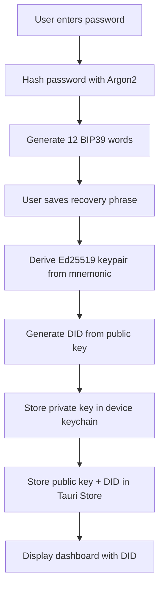
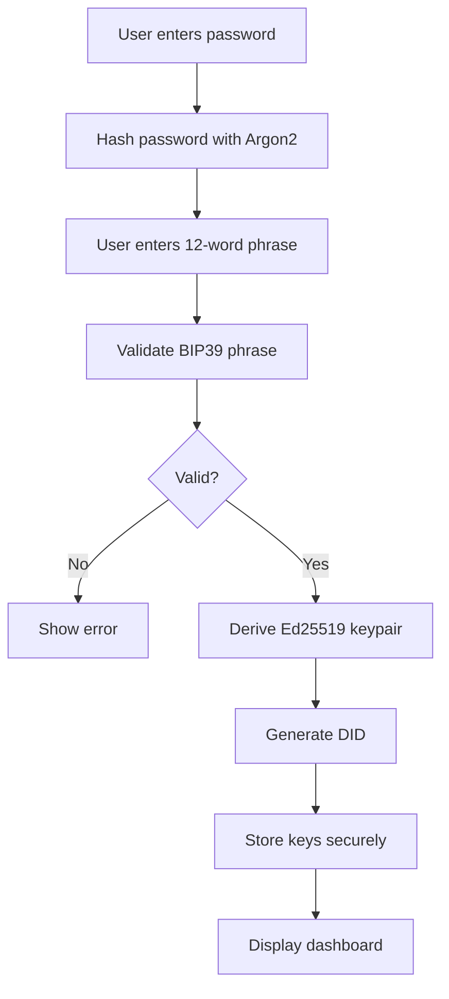

# Arquitectura de la Billetera

Entiende cómo está construida la Billetera Almena ID y cómo protege las identidades de los usuarios.

## Resumen

La Billetera Almena ID es una aplicación nativa multiplataforma construida con:
- **Tauri 2.0**: Framework multiplataforma (backend Rust + frontend web)
- **Svelte 5 + SvelteKit**: Framework de UI reactivo moderno
- **Rust**: Backend para criptografía e integración del sistema

## Soporte de Plataformas

El mismo código base se ejecuta de forma nativa en:
- **Escritorio**: Windows, macOS, Linux
- **Móvil**: Android, iOS

No se necesitan cambios de código entre plataformas - Tauri maneja las diferencias de plataforma.

## Arquitectura de Seguridad

### Estándares Criptográficos

**Generación de Claves**:
- **BIP39**: Generación y validación de mnemónicos de 12 palabras
- **Ed25519**: Criptografía de curva elíptica para pares de claves
- **Determinístico**: El mismo mnemónico siempre produce las mismas claves

**Seguridad de Contraseñas**:
- **Argon2**: Hash de contraseñas estándar de la industria
- **Sin texto plano**: Las contraseñas nunca se almacenan en texto plano
- **Específico del dispositivo**: Cada dispositivo puede tener una contraseña diferente

### Almacenamiento Seguro

**Almacenamiento de Claves Privadas** (Específico de Plataforma):
- **macOS/iOS**: Keychain Services
- **Windows**: Windows Credential Manager  
- **Linux**: Secret Service (GNOME Keyring, KWallet)
- **Android**: Android Keystore

**Almacenamiento de Datos Públicos**:
- **Tauri Plugin Store**: Almacenamiento JSON seguro para:
  - DID (Identificador Descentralizado)
  - Clave pública
  - Hash de contraseña
  - Preferencias del usuario

**¿Por Qué Este Enfoque?**:
- Las claves privadas nunca se exponen a la capa JavaScript
- Cifrado y control de acceso a nivel del sistema operativo
- Integración de autenticación biométrica
- Límites de seguridad entre procesos

### Flujo de Generación de Identidad

### Flujo de Recuperación de Identidad

## Gestión de Sesiones

### Funcionalidad de Bloqueo Automático

**Propósito**: Proteger la identidad cuando el dispositivo está desatendido

**Implementación**:
- Monitorea eventos de actividad del usuario (ratón, teclado, toque)
- Rastrea marca de tiempo de última actividad
- Verifica cada 10 segundos por inactividad
- Se bloquea después de 5 minutos sin actividad

**Estado Bloqueado**:
- Usuario redirigido a pantalla de desbloqueo
- Debe re-autenticarse con contraseña o biométrica
- Estado de sesión preservado
- Sin pérdida de datos

### Autenticación Biométrica

**Plataformas Soportadas**:
- ✅ macOS: Touch ID vía framework LocalAuthentication
- 🔄 iOS: Touch ID / Face ID (próximamente)
- 🔄 Android: API Biométrica (próximamente)
- 🔄 Windows: Windows Hello (próximamente)
- ❌ Linux: No disponible

**Implementación**:
- Integración de API biométrica a nivel del sistema operativo
- Datos biométricos nunca expuestos a la aplicación
- La aplicación solo recibe resultado de éxito/fallo
- La contraseña permanece disponible como respaldo

## Flujo de Datos

### Lo Que Permanece Local

Todo lo relacionado con la identidad es solo local:
- ✅ Claves privadas
- ✅ Frases de recuperación (nunca almacenadas después de la configuración)
- ✅ Contraseñas
- ✅ Generación de DID
- ✅ Derivación de claves

### Lo Que Nunca Se Transmite

La billetera nunca envía por red:
- ❌ Claves privadas
- ❌ Frases de recuperación
- ❌ Contraseñas
- ❌ Palabras mnemónicas
- ❌ Datos biométricos
- ❌ Cualquier material criptográfico sensible

### Lo Que Se Puede Compartir

Seguro de transmitir:
- ✅ DID (identificador público)
- ✅ Claves públicas
- ✅ Credenciales verificables (cuando esté implementado)
- ✅ Mensajes firmados

## Stack Tecnológico

### Frontend
- **Svelte 5**: UI reactivo con runes ($state, $derived)
- **SvelteKit**: Enrutamiento y soporte SSR
- **TypeScript**: Desarrollo con tipos seguros
- **Vite**: Herramienta de construcción rápida

### Backend (Rust)
- **Tauri 2.0**: Framework de aplicación multiplataforma
- **bip39**: Generación de mnemónicos BIP39
- **ed25519-dalek**: Criptografía Ed25519
- **keyring**: Acceso a keychain multiplataforma
- **argon2**: Hash de contraseñas
- **tauri-plugin-store**: Almacenamiento seguro de datos

### Construcción y Distribución
- **Código base único** para todas las plataformas
- **Compilación nativa** por plataforma
- **Tamaño de paquete pequeño**: ~5-15 MB por plataforma
- **Sin dependencias de tiempo de ejecución**: Completamente autocontenido

## Puntos de Integración

### Para Integradores de Aplicaciones

Si bien la billetera es una aplicación independiente, puedes integrarte con ella a través de:

1. **Enlaces Profundos** (próximamente):
   - Activar acciones de billetera desde tu aplicación
   - Solicitar firmas
   - Presentaciones de credenciales

2. **Resolución DID**:
   - El usuario comparte su DID
   - Verificar credenciales usando clave pública
   - Verificación criptográfica

3. **Integración de API** (próximamente):
   - API backend para verificación de identidad
   - Emisión de credenciales
   - Verificación de firmas

## Consideraciones de Seguridad para Integradores

### En Qué Puedes Confiar

✅ **Los DIDs son globalmente únicos**: Sin colisiones
✅ **Las claves públicas son auténticas**: Derivadas determinísticamente
✅ **Las firmas son válidas**: Si se verifican correctamente
✅ **Consistencia multiplataforma**: Mismo DID en todas partes

### Lo Que Debes Verificar

⚠️ **Siempre verificar firmas** antes de confiar en datos
⚠️ **Verificar formato DID** coincide con patrón esperado
⚠️ **Validar credenciales** con criptografía adecuada
⚠️ **No confiar en afirmaciones de identidad del lado del cliente** sin verificación

## Características de Rendimiento

### Tiempo de Inicio
- Inicio en frío: ~1-2 segundos
- Inicio en caliente: ~500ms

### Operaciones de Identidad
- Crear identidad: ~1-2 segundos (generación de claves)
- Recuperar identidad: ~1-2 segundos (derivación de claves)
- Desbloquear: ~100-500ms (verificación de contraseña)
- Desbloqueo biométrico: ~1 segundo (dependiente del sistema operativo)

### Requisitos de Almacenamiento
- Tamaño de aplicación: 5-15 MB (dependiente de plataforma)
- Datos de identidad: Menos de 1 MB por identidad
- Caché: 1-5 MB

## Limitaciones

### Limitaciones Actuales

- Identidad única por dispositivo (multi-identidad próximamente)
- Sin emisión de credenciales aún (próximamente)
- Sin operaciones de firma expuestas aún (próximamente)
- Sin soporte de enlaces profundos aún (próximamente)

### Limitaciones de Plataforma

- Linux: Sin soporte biométrico nativo
- Android/iOS: Implementación biométrica pendiente
- Windows: Implementación de Windows Hello pendiente

## Documentación Relacionada

- [Crear Tu Identidad →](../user-guide/wallet/creating-identity.md)
- [Funcionalidades de Seguridad →](../user-guide/security/auto-lock.md)
- [Plataformas Soportadas →](../user-guide/supported-platforms.md)
- [Referencia de API →](../api-reference/endpoints/health.md)
