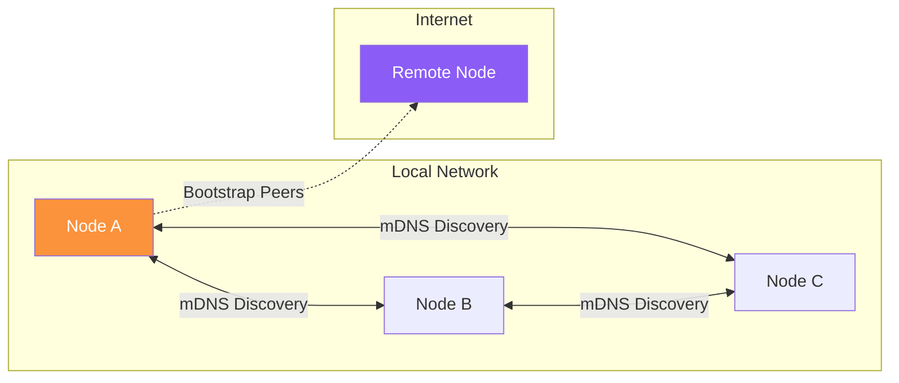

# Configuración del Daemon

El daemon de Almena (`almenad`) es el servicio en segundo plano que alimenta la red P2P y expone la API gRPC. Esta guía cubre cómo instalarlo y ejecutarlo.

## Prerrequisitos

- Toolchain de **Rust** (edición 2021, instalar vía [rustup](https://rustup.rs/))
- Compilador de **Protocol Buffers** (`protoc`)
  - macOS: `brew install protobuf`
  - Linux: `apt install protobuf-compiler`
  - Windows: `choco install protoc`
- **Task** runner ([taskfile.dev](https://taskfile.dev/))

## Instalación desde el Código Fuente

```bash
git clone git@github.com:almena-network/daemon.git
cd daemon
task install
task build
```

El binario de release se encuentra en `target/release/almenad`.

## Ejecución del Daemon

### Modo Desarrollo

```bash
task dev
```

Esto inicia el daemon con:
- Logging de depuración habilitado
- Datos almacenados en el directorio `./workspace/`
- Hot reload mediante `cargo watch`
- Servidor gRPC en `[::1]:50051` (localhost IPv6)

### Modo Producción

```bash
./almenad
```

O con configuración personalizada:

```bash
./almenad --grpc-addr "[::1]:50051"
```

#### Opciones de CLI

| Flag | Por defecto | Descripción |
|------|-------------|-------------|
| `--grpc-addr` | `[::1]:50051` | Dirección de escucha gRPC |
| `--dev` | `false` | Habilitar logging de depuración y usar workspace de desarrollo |
| `--version` | — | Imprimir versión y salir |

### Variables de Entorno

| Variable | Descripción |
|----------|-------------|
| `RUST_LOG` | Anulación del nivel de log (`trace`, `debug`, `info`, `warn`, `error`) |
| `GRPC_ADDR` | Alternativa al flag `--grpc-addr` |
| `ALMENAD_DATA_DIR` | Directorio de datos personalizado (solo modo desarrollo) |

## Directorios de Datos

El daemon almacena sus datos en ubicaciones específicas de cada plataforma:

| Plataforma | Ruta |
|------------|------|
| macOS | `~/Library/Application Support/network.almena.daemon` |
| Linux | `~/.local/share/network.almena.daemon` |
| Windows | `%APPDATA%\network.almena.daemon` |

En modo desarrollo (`--dev`), todos los datos se almacenan en el directorio local `./workspace/`.

## Instaladores por Plataforma

Hay instaladores preconstruidos disponibles para cada plataforma:

| Plataforma | Formato | Comando de Build |
|------------|---------|------------------|
| macOS | `.pkg` (firmado y notarizado) | `task package:darwin` |
| Linux | `.deb` | `task package:linux` |
| Windows | `.msi` | `task package:windows` |

El instalador de macOS registra el daemon como un **LaunchAgent** (se inicia automáticamente al iniciar sesión). En Linux, se crea un servicio de usuario **systemd**. En Windows, se ejecuta como un **Windows Service**.

## Verificación de la Instalación

Una vez que el daemon está en ejecución, verifica la conectividad con cualquier cliente gRPC:

```bash
# Usando grpcurl
grpcurl -plaintext '[::1]:50051' almena.daemon.v1.DaemonService/Ping
```

Respuesta esperada:

```json
{
  "message": "pong"
}
```

El daemon también soporta **gRPC Server Reflection**, por lo que herramientas como Postman y grpcurl pueden descubrir todos los métodos disponibles automáticamente.

## API REST

El daemon también expone una API REST para verificaciones rápidas de estado:

```bash
# Endpoint REST por defecto
curl http://127.0.0.1:8080/status

# Swagger UI
open http://127.0.0.1:8080/swagger-ui/
```

La dirección REST es configurable mediante `--rest-addr`.

## Red P2P

El daemon descubre automáticamente otros nodos de Almena en tu red local usando **mDNS** (DNS multicast). Los peers descubiertos aparecen en la respuesta de `ListPeers`.



| Capa | Tecnología | Detalles |
|------|-----------|----------|
| **Transporte** | TCP | Soporte IPv4 + IPv6 |
| **Cifrado** | Noise protocol | Todo el tráfico P2P cifrado |
| **Multiplexación** | Yamux | Múltiples streams por conexión |
| **Descubrimiento** | mDNS | Peers en LAN (intervalo de consulta de 5 segundos) |
| **Protocolo personalizado** | `/almena/geo/1.0` | Intercambio de datos de geolocalización entre peers |

Los peers de bootstrap se pueden configurar mediante la variable de entorno `BOOTSTRAP_PEERS` para descubrimiento por internet.

:::info Próximamente
La conectividad basada en relay para traversal de NAT está planificada para futuras versiones.
:::
