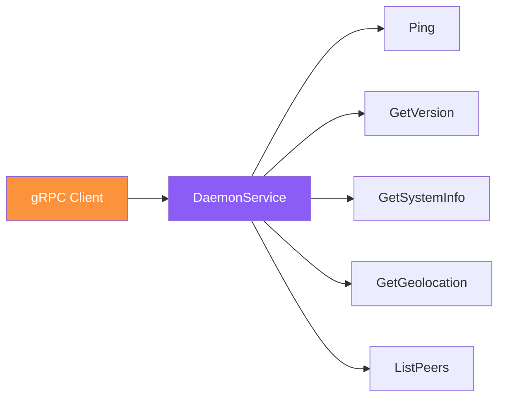

# Referencia de API gRPC

El daemon de Almena expone una API gRPC definida en el paquete `almena.daemon.v1`. El endpoint por defecto es `[::1]:50051` (localhost IPv6).

## Descripción General del Servicio



## Servicio: DaemonService

### Ping

Verificación de salud para confirmar que el daemon está en ejecución.

```protobuf
rpc Ping(PingRequest) returns (PingResponse);
```

**Request**: Mensaje vacío.

**Response**:

| Campo | Tipo | Descripción |
|-------|------|-------------|
| `message` | `string` | Siempre devuelve `"pong"` |

---

### GetVersion

Devuelve la cadena de versión del daemon.

```protobuf
rpc GetVersion(GetVersionRequest) returns (GetVersionResponse);
```

**Request**: Mensaje vacío.

**Response**:

| Campo | Tipo | Descripción |
|-------|------|-------------|
| `version` | `string` | Versión del daemon (ej., `"2026.1.1-develop"`) |

---

### GetSystemInfo

Devuelve información sobre el sistema operativo del host.

```protobuf
rpc GetSystemInfo(GetSystemInfoRequest) returns (GetSystemInfoResponse);
```

**Request**: Mensaje vacío.

**Response**:

| Campo | Tipo | Descripción |
|-------|------|-------------|
| `os_name` | `string` | Nombre del sistema operativo (ej., `"macOS"`) |
| `os_version` | `string` | Cadena de versión del SO (ej., `"15.3.2"`) |

---

### GetGeolocation

Devuelve datos de geolocalización basados en la dirección IP pública del nodo. Los datos se obtienen de la API de ipapi.co.

```protobuf
rpc GetGeolocation(GetGeolocationRequest) returns (GetGeolocationResponse);
```

**Request**: Mensaje vacío.

**Response**:

| Campo | Tipo | Descripción |
|-------|------|-------------|
| `ip` | `string` | Dirección IP pública |
| `city` | `string` | Nombre de la ciudad |
| `region` | `string` | Región o estado |
| `country_code` | `string` | Código de país ISO (ej., `"US"`) |
| `country_name` | `string` | Nombre completo del país |
| `timezone` | `string` | Identificador de zona horaria (ej., `"America/New_York"`) |
| `latitude` | `double` | Latitud geográfica |
| `longitude` | `double` | Longitud geográfica |

:::note
Este endpoint requiere acceso a internet. Devolverá un error gRPC si la API externa no está disponible.
:::

---

### ListPeers

Devuelve todos los peers P2P descubiertos, incluyendo el nodo local.

```protobuf
rpc ListPeers(ListPeersRequest) returns (ListPeersResponse);
```

**Request**: Mensaje vacío.

**Response**:

| Campo | Tipo | Descripción |
|-------|------|-------------|
| `peers` | `PeerInfo[]` | Lista de peers descubiertos |

#### PeerInfo

| Campo | Tipo | Descripción |
|-------|------|-------------|
| `peer_id` | `string` | Identificador único del peer (libp2p PeerId) |
| `addresses` | `string[]` | Multidirecciones donde este peer es alcanzable |
| `is_internal` | `bool` | `true` si el peer está en la red local (LAN) |
| `is_connected` | `bool` | `true` si está conectado actualmente |
| `is_self` | `bool` | `true` si esta entrada representa el daemon local |
| `geo` | `GetGeolocationResponse?` | Geolocalización de este peer (cuando está disponible) |

---

## Archivo Proto

La definición canónica del proto se encuentra en:

```
daemon/proto/almena/daemon/v1/service.proto
```

### Definición Completa

```protobuf
syntax = "proto3";

package almena.daemon.v1;

service DaemonService {
  rpc Ping(PingRequest) returns (PingResponse);
  rpc GetVersion(GetVersionRequest) returns (GetVersionResponse);
  rpc GetSystemInfo(GetSystemInfoRequest) returns (GetSystemInfoResponse);
  rpc GetGeolocation(GetGeolocationRequest) returns (GetGeolocationResponse);
  rpc ListPeers(ListPeersRequest) returns (ListPeersResponse);
}

message PingRequest {}
message PingResponse { string message = 1; }

message GetVersionRequest {}
message GetVersionResponse { string version = 1; }

message GetSystemInfoRequest {}
message GetSystemInfoResponse {
  string os_name = 1;
  string os_version = 2;
}

message GetGeolocationRequest {}
message GetGeolocationResponse {
  string ip = 1;
  string city = 2;
  string region = 3;
  string country_code = 4;
  string country_name = 5;
  string timezone = 6;
  double latitude = 7;
  double longitude = 8;
}

message ListPeersRequest {}
message ListPeersResponse {
  repeated PeerInfo peers = 1;
}

message PeerInfo {
  string peer_id = 1;
  repeated string addresses = 2;
  bool is_internal = 3;
  bool is_connected = 4;
  bool is_self = 5;
  GetGeolocationResponse geo = 6;
}
```

## Server Reflection

El daemon tiene habilitado **gRPC Server Reflection**. Las herramientas compatibles (Postman, grpcurl, BloomRPC) pueden descubrir todos los servicios y métodos disponibles automáticamente sin necesidad del archivo proto.

## Ejemplos de Conexión

### grpcurl

```bash
# Listar todos los servicios
grpcurl -plaintext '[::1]:50051' list

# Llamar a Ping
grpcurl -plaintext '[::1]:50051' almena.daemon.v1.DaemonService/Ping

# Obtener versión
grpcurl -plaintext '[::1]:50051' almena.daemon.v1.DaemonService/GetVersion

# Listar peers
grpcurl -plaintext '[::1]:50051' almena.daemon.v1.DaemonService/ListPeers
```

### Rust (tonic)

```rust
use tonic::transport::Channel;

// Generated from proto
pub mod daemon {
    tonic::include_proto!("almena.daemon.v1");
}

use daemon::daemon_service_client::DaemonServiceClient;
use daemon::PingRequest;

#[tokio::main]
async fn main() -> Result<(), Box<dyn std::error::Error>> {
    let channel = Channel::from_static("http://[::1]:50051")
        .connect()
        .await?;

    let mut client = DaemonServiceClient::new(channel);
    let response = client.ping(PingRequest {}).await?;

    println!("Response: {}", response.into_inner().message);
    Ok(())
}
```
