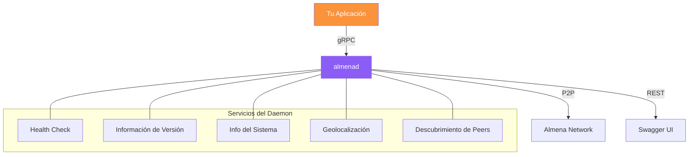
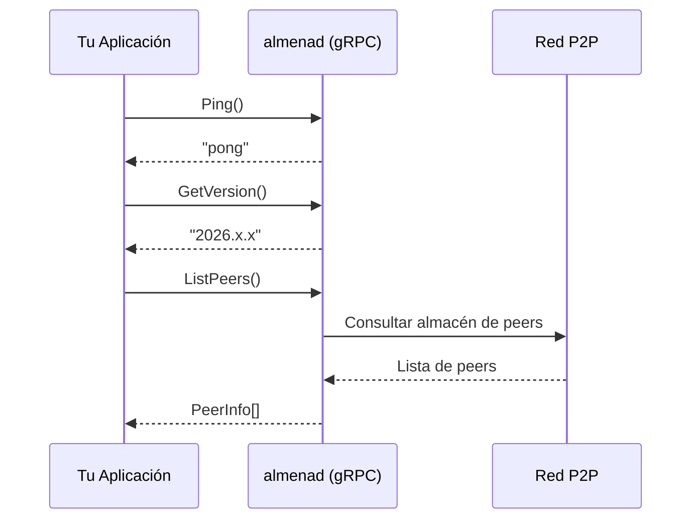

# Almena Network para Integradores

Esta sección proporciona documentación para desarrolladores que integran sus aplicaciones con la plataforma Almena Network.

## Arquitectura de Integración

## Puntos de Integración

Almena Network expone dos APIs a través de su servicio daemon (`almenad`):

### API gRPC (Principal)

La API gRPC es el punto de integración principal. Endpoint por defecto: `[::1]:50051`.

| Capacidad | Método RPC | Descripción |
|-----------|------------|-------------|
| **Health Check** | `Ping` | Verificar que el daemon está en ejecución y responde |
| **Info de Versión** | `GetVersion` | Consultar la versión del daemon programáticamente |
| **Info del Sistema** | `GetSystemInfo` | Obtener nombre y versión del SO del host |
| **Geolocalización** | `GetGeolocation` | Obtener geolocalización por IP pública del nodo (ciudad, país, coordenadas) |
| **Descubrimiento de Peers** | `ListPeers` | Listar todos los peers P2P descubiertos con estado de conexión y tipo de red |

### API REST (Secundaria)

Una API REST ligera con Swagger UI para verificaciones rápidas de estado. Endpoint por defecto: `127.0.0.1:8080`.

| Endpoint | Descripción |
|----------|-------------|
| `GET /status` | Estado del daemon, versión, direcciones gRPC/REST |
| `GET /api/v1/status` | Igual que arriba (versionado) |
| `GET /swagger-ui/` | Documentación interactiva OpenAPI 3.0 |

### Guías de Integración

- [**Configuración del Daemon**](./daemon-setup) — Instala y ejecuta el daemon de Almena en tu sistema.
- [**Referencia de API gRPC**](./grpc-api) — Referencia completa de todos los métodos RPC y tipos de mensaje disponibles.

## Protocolo y Estándares

Almena Network sigue los estándares W3C para identidad descentralizada:

- **DIDs** ([Identificadores Descentralizados](https://www.w3.org/TR/did-1.0/)) v1.0
- **Credenciales Verificables** ([Modelo de Datos](https://www.w3.org/TR/vc-data-model-2.0/)) v2.0
- **DIDComm** v2 para mensajería segura

La API gRPC usa Protocol Buffers (proto3) como formato de serialización. La definición canónica del proto se encuentra en el repositorio del daemon en `proto/almena/daemon/v1/service.proto`.

## Flujo de Conexión

:::info Próximamente
Las APIs de emisión de credenciales, verificación de presentaciones y marco de confianza se añadirán a medida que se implementen.
:::
