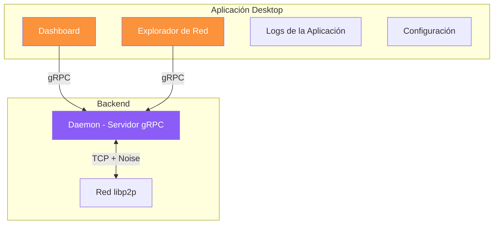
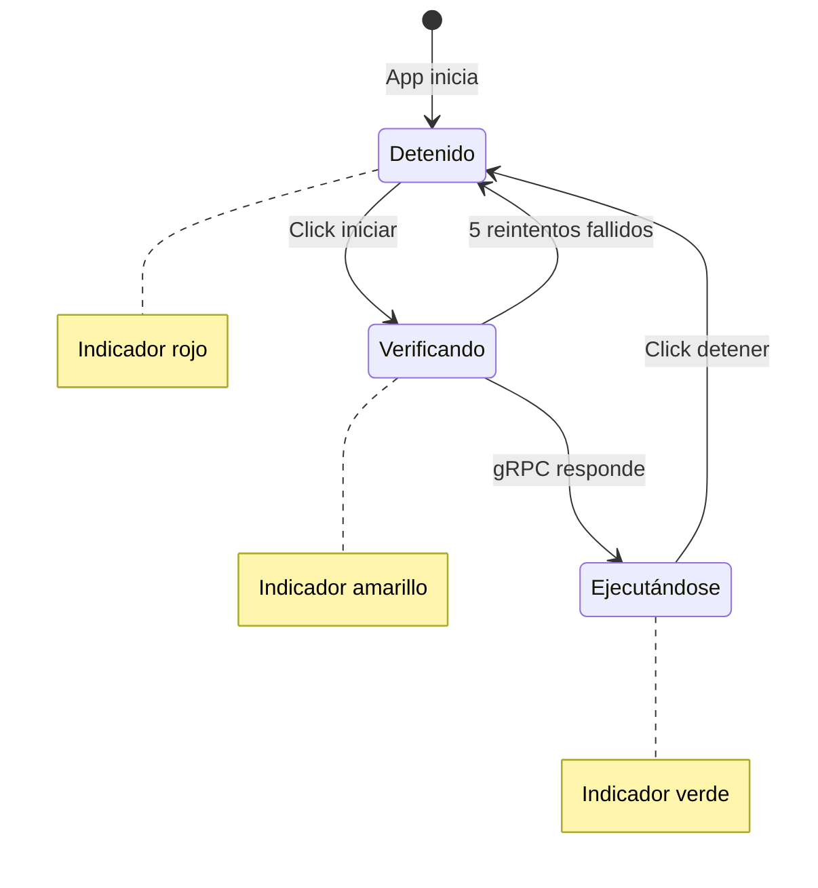

# Desktop: Explorador de Red

La aplicación Almena Desktop es una consola de administración para organizaciones participantes en la Almena Network. Incluye un Explorador de Red que proporciona una vista en tiempo real de la red peer-to-peer.

## Resumen de la Aplicación

## Primeros Pasos

1. Abre la aplicación Almena Desktop.
2. El encabezado muestra el **Estado del Daemon** — asegúrate de que esté en ejecución (indicador verde).
3. Navega entre secciones usando el **dock inferior** (navegación flotante estilo macOS).

## Dashboard

El Dashboard proporciona un resumen de tu nodo:

- **Estado del daemon** — En ejecución o detenido, con información de versión.
- **ID del nodo** — Tu identificador de peer en la red P2P.
- **IP pública** — La dirección IP pública de tu nodo.
- **Mapa mundial** — Mapa interactivo mostrando tu nodo (marcador naranja) y nodos peer (marcadores violeta) en sus posiciones geográficas.

El dashboard consulta al daemon cada 5 segundos para actualizaciones en tiempo real.

## Explorador de Red

La página de Red muestra todos los peers descubiertos en una lista detallada:

| Columna | Descripción |
|---------|-------------|
| **Peer ID** | Identificador truncado (primeros 12 caracteres) |
| **Estado** | Punto verde = conectado, Punto gris = desconectado |
| **Red** | LAN (red local) o Internet |
| **Ubicación** | Ciudad y país basado en geolocalización por IP |
| **Direcciones** | Número de direcciones de red |

Tu propio nodo está marcado con una insignia **"Este nodo"**.

## Control del Daemon

El **Botón de Estado del Daemon** en el encabezado controla el servicio en segundo plano:

- **Punto rojo** — Daemon detenido. Click para iniciar.
- **Punto verde** — Daemon en ejecución. Click para detener.
- **Punto amarillo** — Verificando estado del daemon (reintenta hasta 5 veces con retraso de 500ms).

## Logs de la Aplicación

La página de Logs muestra los archivos de log rotativos de la aplicación:

- Filtra por `almena-desktop.log` y archivos con marca de fecha.
- Botón de actualización manual.
- Auto-desplazamiento al final para las últimas entradas.

## Limitaciones Actuales

- El descubrimiento de peers está limitado a la **red local (LAN)** vía mDNS. El descubrimiento por Internet requiere nodos bootstrap.
- Los datos de geolocalización se obtienen de una API pública (ipapi.co) y requieren acceso a Internet.
- La gestión de configuración está en desarrollo.
