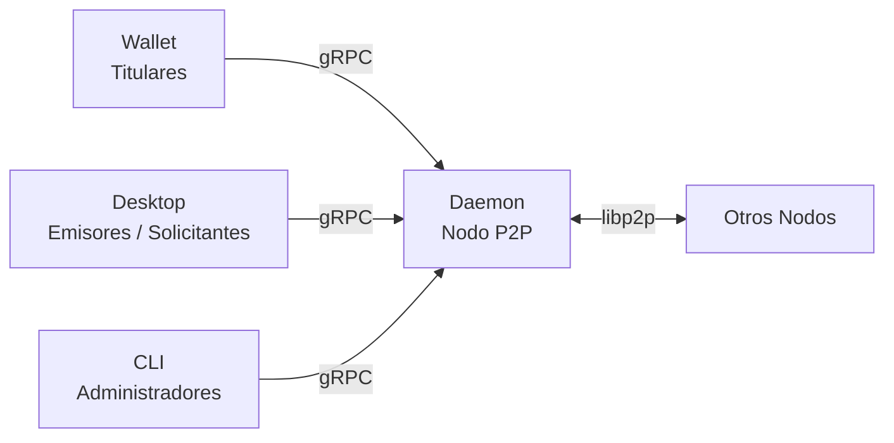

# Almena Network para Usuarios

Almena Network es una plataforma descentralizada. La identidad es una de sus capacidades centrales: puedes crear y gestionar tu identidad digital (DID) y credenciales sin intermediarios centrales. A diferencia de los sistemas tradicionales donde una empresa es dueña de tu cuenta, aquí **tú eres dueño de tu identidad**.

## ¿Qué es Almena Network?

Almena Network está construida sobre estándares abiertos ([W3C](https://www.w3.org/)) y consta de dos aplicaciones principales:

- **Wallet** — Tu billetera personal de identidad donde creas y gestionas tu identidad descentralizada (DID). Diseñada como experiencia mobile-first.
- **Desktop** — Una consola de administración para organizaciones que emiten o solicitan credenciales verificables.

Ambas aplicaciones se conectan a un servicio en segundo plano llamado **Daemon**, que gestiona la red peer-to-peer y la comunicación entre nodos.

## Roles en la Red

| Rol | Aplicación | Descripción |
|-----|-----------|-------------|
| **Titular** | Wallet | Individuos que poseen y controlan su identidad digital y credenciales |
| **Emisor** | Desktop | Organizaciones que crean y firman credenciales verificables |
| **Solicitante** | Desktop | Organizaciones que solicitan y verifican credenciales |
| **Administrador** | CLI / Desktop | Gestiona nodos daemon e infraestructura de red |

## Funcionalidades Disponibles

### Wallet

La wallet proporciona una experiencia completa de gestión de identidad:

- **Creación de cuenta** — Onboarding guiado en 6 pasos para crear tu identidad descentralizada (DID).
- **Protección por contraseña** — Contraseña segura con validación en tiempo real (8+ caracteres, mayúsculas, minúsculas, dígitos).
- **Generación de identidad** — Creación automática de DID con derivación de claves criptográficas.
- **Autenticación biométrica** — Configuración opcional de huella dactilar o Face ID para desbloqueo rápido.
- **Respaldo en la nube** — Respaldo cifrado en Google Drive o iCloud para recuperación de identidad.
- **Recuperación de cuenta** — Flujo completo de 6 pasos para restaurar tu identidad desde un respaldo en la nube.
- **Pantalla de bloqueo** — Bloqueo biométrico o por contraseña con tiempo de inactividad.
- **Escaneo de códigos QR** — Escanea códigos QR para intercambio de credenciales.
- **Multi-idioma** — Disponible en inglés y español.

### Desktop (Consola de Administración)

La aplicación de escritorio proporciona herramientas para la administración de la red:

- **Explorador de Red** — Mapa mundial interactivo mostrando peers conectados en la red P2P, con estado de conexión en tiempo real y datos de geolocalización.
- **Control del Daemon** — Inicia, detiene y monitorea el servicio daemon directamente desde la interfaz.
- **Logs de la Aplicación** — Visualiza y filtra archivos de log rotativos de la aplicación.
- **Multi-idioma** — Disponible en inglés y español, autodetectado desde el idioma del sistema.

## Primeros Pasos

Elige tu aplicación para comenzar:

- [**Wallet — Primeros Pasos**](./wallet-getting-started) — Crea tu primera identidad.
- [**Wallet — Recuperación**](./wallet-recovery) — Restaura una identidad existente desde un respaldo en la nube.
- [**Desktop — Explorador de Red**](./desktop-network) — Explora la red peer-to-peer.
