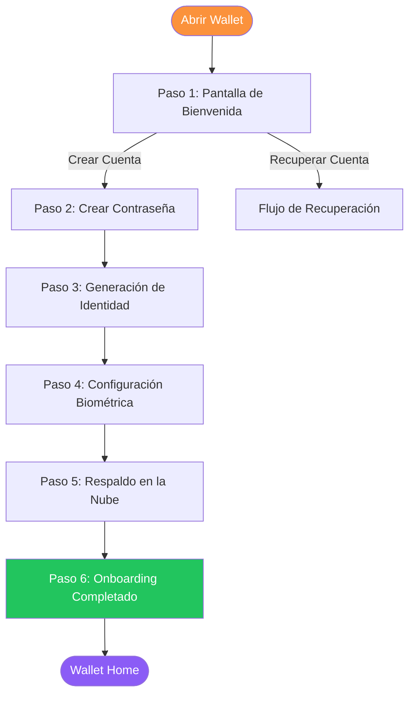
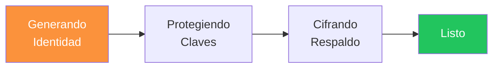
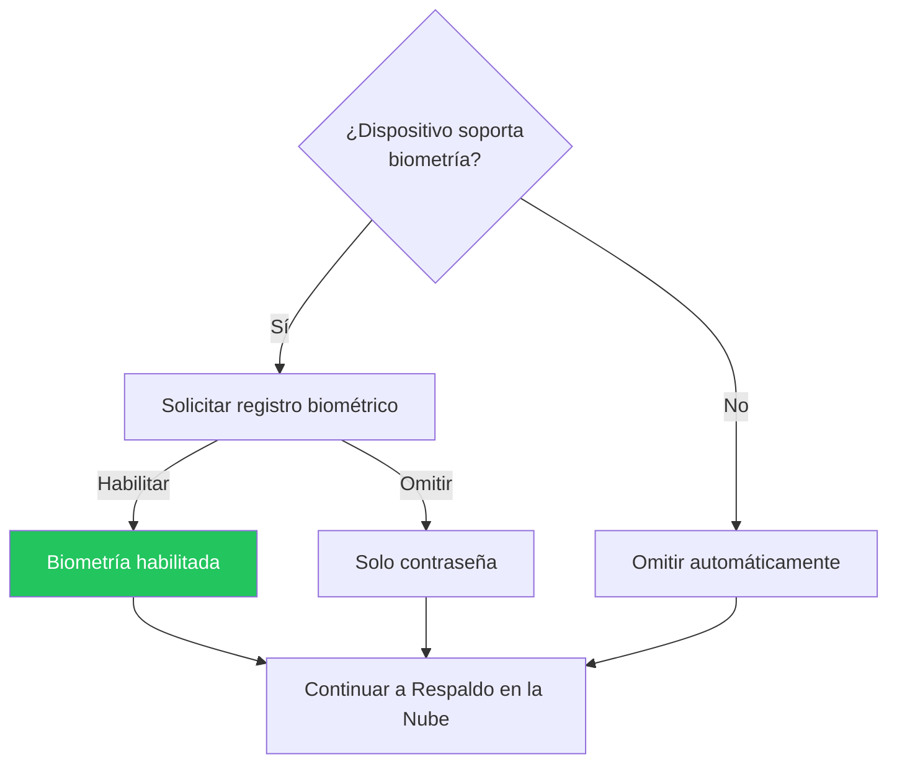

# Wallet: Primeros Pasos

La Almena Wallet es tu aplicación personal de identidad. Te permite crear y gestionar tu identidad descentralizada (DID) en tu propio dispositivo a través de un proceso guiado de 6 pasos.

## Resumen del Onboarding

## Paso 1: Pantalla de Bienvenida

Cuando abres la wallet por primera vez, verás la pantalla de bienvenida con dos opciones:

- **Crear Cuenta** — Comienza desde cero con una nueva identidad descentralizada.
- **Recuperar Cuenta** — Restaura una identidad existente desde un respaldo en la nube (ver [Wallet: Recuperación](../wallet-recovery)).

Toca **Crear Cuenta** para comenzar el proceso de onboarding.

## Paso 2: Crear Contraseña

Se te pedirá crear una contraseña segura que proteja tu identidad en este dispositivo. La wallet valida tu contraseña en tiempo real con las siguientes reglas:

- Mínimo **8 caracteres**
- Al menos una letra **mayúscula** (A-Z)
- Al menos una letra **minúscula** (a-z)
- Al menos un **dígito** (0-9)

Cada regla muestra un indicador visual mientras escribes — aparece una marca de verificación cuando se cumple una regla. Debes confirmar la contraseña ingresándola nuevamente. Puedes alternar la visibilidad de la contraseña usando el botón mostrar/ocultar en cada campo.

:::warning Importante
Esta contraseña se usa para cifrar tus claves privadas localmente. No existe opción de "olvidé mi contraseña". Si pierdes esta contraseña y no tienes respaldo en la nube, tu identidad no podrá ser recuperada.
:::

## Paso 3: Generación de Identidad

Después de establecer tu contraseña, la wallet genera automáticamente tu identidad descentralizada. Este proceso incluye varias etapas:

1. **Generando identidad** — Crea un DID único usando claves criptográficas P-256 ECDSA.
2. **Protegiendo claves** — Deriva claves de cifrado a partir de tu contraseña usando Argon2.
3. **Cifrando respaldo** — Prepara dos blobs de respaldo cifrados (uno para uso local, otro para almacenamiento en la nube).
4. **Listo** — Tu identidad está creada y lista para usar.

Todo esto ocurre localmente en tu dispositivo — ningún dato se envía a ningún servidor.

## Paso 4: Configuración Biométrica

Si tu dispositivo soporta autenticación biométrica (huella dactilar o Face ID), se te pedirá habilitarla.

- **Habilitar biometría** — Permite desbloquear la wallet rápidamente usando tu huella o rostro. Recomendado por conveniencia.
- **Omitir** — Continúa solo con autenticación por contraseña. Puedes habilitar la biometría después desde configuración.

## Paso 5: Respaldo en la Nube

La wallet ofrece respaldo cifrado en la nube para proteger tu identidad contra la pérdida del dispositivo.

**Proveedores disponibles:**
- Google Drive
- iCloud

**Cómo funciona:**

1. Elige un proveedor de nube de las opciones disponibles.
2. Autentícate con el proveedor (abre un flujo de inicio de sesión seguro).
3. La wallet sube un respaldo **cifrado** de tu identidad.

:::info
El respaldo se cifra con tu contraseña antes de salir de tu dispositivo. El proveedor de nube no puede leer los datos de tu identidad. Solo alguien con tu contraseña puede descifrarlo.
:::

Puedes omitir este paso, pero una advertencia te recordará que sin respaldo, perder tu dispositivo significa perder tu identidad.

## Paso 6: Onboarding Completado

La pantalla de finalización muestra un resumen de tu nueva identidad:

- **Tu DID** — Tu identificador descentralizado único (con botón de copiar).
- **Checklist** — Estado de cada paso de configuración:
  - Identidad creada
  - Biometría habilitada / omitida
  - Respaldo en la nube completado / omitido

Toca **Entrar a la Wallet** para acceder a la pantalla principal.

## Después del Onboarding

### Wallet Home

Tu pantalla principal de la wallet muestra:

- Tu DID truncado con botón de copiar.
- Número de contextos de identidad.
- Estado de biometría.

### Pantalla de Bloqueo

Si la autenticación biométrica está habilitada, la wallet se bloquea automáticamente:

- Después de **30 segundos** en segundo plano.
- Después de **5 minutos** de inactividad.

Puedes desbloquear con tu huella, Face ID o contraseña.

### Acciones Disponibles

- **Escanear** — Escanea códigos QR para intercambio de credenciales.
- **Mensajes** — Ver mensajes relacionados con credenciales.
- **Configuración** — Gestionar preferencias de la wallet.
- **Cerrar sesión** — Reiniciar la wallet y eliminar todos los datos locales.

## Detalles Técnicos

- La wallet funciona como una aplicación nativa construida con [Tauri](https://tauri.app/) — disponible en escritorio, Android e iOS.
- Las claves privadas se cifran usando AES-256-GCM con claves derivadas por Argon2.
- Los respaldos en la nube usan cifrado XChaCha20-Poly1305.
- Ningún dato se envía a ningún servidor durante la creación de la cuenta — todo ocurre localmente en tu dispositivo.
- La interfaz está optimizada para una experiencia mobile-first (viewport 390x844).
