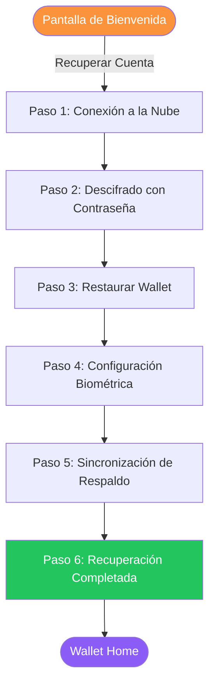
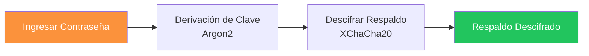

# Wallet: Recuperación

Si has perdido acceso a tu dispositivo o necesitas restaurar tu identidad en uno nuevo, la Almena Wallet proporciona un flujo de recuperación de 6 pasos usando tu respaldo cifrado en la nube.

## Requisitos Previos

Para recuperar tu identidad, necesitas:

- Un **respaldo en la nube** creado durante el onboarding (Google Drive o iCloud).
- Tu **contraseña** usada cuando la identidad fue creada originalmente.

## Resumen de la Recuperación

## Paso 1: Conexión a la Nube

1. Selecciona el proveedor de nube donde se encuentra tu respaldo (Google Drive o iCloud).
2. Autentícate con el proveedor.
3. La wallet busca y descarga tu respaldo cifrado.

Si no se encuentra ningún respaldo, verifica que estés usando la cuenta de nube correcta.

## Paso 2: Descifrado con Contraseña

Ingresa la contraseña que usaste cuando creaste originalmente tu identidad. La wallet usa esta contraseña para descifrar los datos del respaldo.

:::warning
Si has olvidado tu contraseña, el respaldo no puede ser descifrado. No existe mecanismo de recuperación de contraseña — esto es por diseño para proteger tu identidad.
:::

## Paso 3: Restaurar Wallet

La wallet restaura tu identidad desde el respaldo descifrado. Este proceso incluye:

1. **Verificar identidad raíz** — Valida el DID raíz y las claves criptográficas.
2. **Generar claves del dispositivo** — Crea nuevos pares de claves específicos del dispositivo.
3. **Restaurar contextos** — Reconstruye todos los contextos de identidad y credenciales asociadas.
4. **Reconstruir almacenamiento local** — Reconstruye el almacenamiento cifrado local.

El progreso se muestra en tiempo real durante la restauración.

## Paso 4: Configuración Biométrica

Igual que durante el onboarding — puedes habilitar huella dactilar o Face ID para desbloqueo rápido, u omitir este paso.

## Paso 5: Sincronización de Respaldo

Después de la restauración, la wallet sincroniza el estado actualizado de vuelta a tu proveedor de nube. Esto asegura que el respaldo refleje cualquier cambio específico del dispositivo (ej. nuevas claves del dispositivo).

## Paso 6: Recuperación Completada

La pantalla de finalización muestra tu identidad restaurada:

- **Tu DID** — Confirmado que coincide con la identidad original.
- **Checklist** — Estado de cada paso de recuperación.

Toca **Entrar a la Wallet** para acceder a tu wallet restaurada.

## Consideraciones de Seguridad

- Las sesiones de recuperación tienen un **timeout de 10 minutos** — si permaneces inactivo demasiado tiempo, la sesión se limpia y debes empezar de nuevo.
- La wallet confirma antes de salir durante pasos críticos de recuperación para prevenir pérdida accidental de datos.
- Todo el descifrado ocurre localmente en tu dispositivo.
